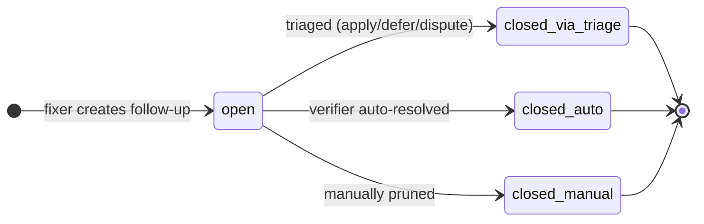

# Periodic chunked reviews

This directory hosts the **standing artifacts** for envy-nx's periodic agentic code review. Per-PR review only Checks the delta - drift, dead code, and decisions that aged out are invisible to it. This framework Checks the standing state on a manual cadence, one shard at a time.

For the design rationale (why chunked, why subagents, why manual trigger), see [`docs/decisions.md` → "Process decisions"](../../docs/decisions.md).

## Shards

The nine standing review shards. `name` is what you pass to `/review <name>`. Source of truth for the manifest is [`shards.json`](shards.json) - this table is for human eyeballs.

| Name                   | Surface                                                | Blast radius | Charter                                                     |
| ---------------------- | ------------------------------------------------------ | ------------ | ----------------------------------------------------------- |
| `certs`                | Cert / proxy path                                      | high         | [certs.md](charters/certs.md)                               |
| `orchestration`        | `nix/setup.sh` + phase library                         | high         | [orchestration.md](charters/orchestration.md)               |
| `nx-cli`               | nx CLI (`.assets/lib/nx_*.sh`)                         | high         | [nx-cli.md](charters/nx-cli.md)                             |
| `config-templates`     | shell / pwsh / oh-my-posh templates                    | medium       | [config-templates.md](charters/config-templates.md)         |
| `system-installers`    | root-required installers + `linux_setup.sh`            | high         | [system-installers.md](charters/system-installers.md)       |
| `wsl-orchestration`    | Windows-host PowerShell (`wsl/*.ps1`)                  | medium       | [wsl-orchestration.md](charters/wsl-orchestration.md)       |
| `precommit-hooks`      | `tests/hooks/*.py` - the gate scripts                  | medium       | [precommit-hooks.md](charters/precommit-hooks.md)           |
| `test-quality`         | `tests/bats/*` + `tests/pester/*`                      | low          | [test-quality.md](charters/test-quality.md)                 |
| `enterprise-readiness` | extension points + enterprise.md / benefits.md posture | medium       | [enterprise-readiness.md](charters/enterprise-readiness.md) |

All nine charters are seeded as v1 drafts. Each will get refined on its first `/review <name>` run - the first pass surfaces what the charter actually needs to constrain, since speculative scope often misses real-world edge cases.

The `enterprise-readiness` shard is structurally different from the other eight: it reviews *posture*, not code correctness, and its findings have two output paths - some get fixed in the codebase, others get added to `docs/enterprise.md` as integration-side responsibility. See its charter for the binding constraints (standalone integrity, no pollution by unused functionality) and the resist-adding-code mechanism that makes it work.

## What a review session looks like

A review takes ~20-40 minutes for one shard, end to end. Here's the actual experience, organized by the four `/review` commands in the order you'd use them.

### `/review status` - see what's overdue

Type `/review status`:

```text
shard                last-run       days-since   findings
certs                2026-04-22         17           5
nx-cli               2026-04-15         24           8
wsl-orchestration    never              ∞           -
precommit-hooks      never              ∞           -
...
```

`wsl-orchestration` has never been reviewed and there was an fnm change to it last week. You decide on that one.

### `/review <shard>` - run the review

Type `/review wsl-orchestration`. Claude spawns the reviewer subagent in its own context window. Status updates flow as it works: "reading charter... listing files in scope (4 ps1, 2 cmd)... analyzing." A few minutes later it returns:

```text
Reviewed wsl-orchestration: 8 findings (0 critical / 2 high / 4 medium / 2 low).
See .wolf/reviews/2026-05-09-wsl-orchestration.json.
Run /review act <path> to triage.
```

You optionally peek at the JSON to spot-check - findings reference real files at sensible lines, severities match the rubric, no obvious hallucinations. Looks reasonable.

### `/review act <findings-path>` - triage, fix, verify

This single command runs three internal phases (triage → fixer → verifier) before handing back to you for the push.

**Triage.** Type `/review act .wolf/reviews/2026-05-09-wsl-orchestration.json`. Claude walks each finding via `AskUserQuestion`:

```text
F-001 [high/correctness] wsl/wsl_setup.ps1:142
The fnm self-heal block doesn't check whether $env:XDG_RUNTIME_DIR exists
before calling chmod, which fails silently on native Windows pwsh.
Suggestion: wrap in a Linux-detection guard.

apply | defer | dispute?
```

You click **apply**. Next finding. You click **defer** for one - Claude prompts for a one-line rationale and an optional "re-evaluate when:" trigger. You write "wait until the WSL test branch lands; that file is being rewritten anyway." Claude appends entry `A-007` to `accepted.md` so the next review of this shard skips it.

You click **dispute** for one where the reviewer misread a Pester mock as production code. You explain why. Claude appends it as a dispute - no `re-evaluate when:` trigger, because dispute means "this is not a problem, full stop."

After eight findings: 4 applied, 2 deferred, 2 disputed.

**Fix.** The fixer subagent spawns automatically. Per-finding progress:

```text
F-001: edit applied at wsl_setup.ps1:142
       make lint: pass; make test-unit: pass
       commit: fix(wsl-orchestration): guard fnm self-heal on Linux only [F-001]
F-003: edit applied at wsl_certs_add.ps1:88
       make lint: pass; make test-unit: pass
       commit: fix(wsl-orchestration): handle null cert serial gracefully [F-003]
...
```

After ~15 minutes:

```text
Branch ready: review/wsl-orchestration-2026-05-09
Applied: 4 [F-001, F-003, F-004, F-006]
Disputed (fix-broke-tests): 0
make lint: pass
make test-unit: pass
```

**Verify.** The verifier subagent spawns. It reads the diff cold - no knowledge of how the fixer reasoned. Reports per-finding verdicts:

```text
F-001  confirmed
F-003  confirmed
F-004  confirmed
F-006  symptom-only - the fixer added a guard at line 80, but the broken state
       at line 145 is still reachable via the alternative WSL2 code path.
```

F-006 needs another look. Three options:

- **Push the branch as-is** and address F-006 in a follow-up commit (verifier's note goes in the PR body so reviewers see the gap up front).
- **Re-run the fixer** via `/review fix F-006`. The skill auto-loads the active findings JSON from `state.json`, shows you the verifier's prior `symptom-only` note inline, and prompts for revised guidance ("the fix needs to handle the WSL2 path at line 145 too"). The fixer makes a new commit suffixed `[F-006, retry-1]`, writes back the new `fixer_commit` and `retry_count`; the verifier re-runs and overwrites the prior verdict in the findings JSON.
- **Demote F-006 to deferred** in `accepted.md` if you decide the partial fix is good enough for now and revisit next cycle.

**Push.** You go with option 1, push the branch, open the PR. The PR body summarizes:

```text
## Applied (4)
- F-001: guard fnm self-heal on Linux only
- F-003: handle null cert serial gracefully
- F-004: ...
- F-006: ...  ⚠ verifier flagged symptom-only - see notes

## Deferred (2)
- A-007: wait until the WSL test branch lands
- A-008: ...

## Disputed (2)
- A-009 (no re-evaluate): reviewer misread a Pester mock as prod code
- A-010: ...

## Verifier report
[full table from the verifier subagent]
```

**Total time:** ~35 minutes. The shard's `last_run` in `.wolf/reviews/state.json` is now today.

### `/review fix <finding-id>` - retry on a verifier flag (optional)

Skip this step entirely if every verifier verdict was `confirmed`. When the verifier flagged something (`symptom-only`, `regression-risk`, `over-corrected`, `not-applied`) and you want to retry rather than push-as-is or demote, this is the targeted retry command.

Type `/review fix F-006`. The skill auto-loads the active findings JSON from `.wolf/reviews/state.json` (no path argument - it knows where you just were), looks up F-006, and shows you its current state inline:

```text
F-006 [high/correctness] wsl/wsl_setup.ps1:142
fnm self-heal block doesn't check XDG_RUNTIME_DIR before chmod...
Suggestion: wrap in a Linux-detection guard.

Verifier verdict: symptom-only
Verifier note: the fixer added a guard at line 80, but the broken state
              at line 145 is still reachable via the alternative WSL2 code path.
Prior commit: a3f2c1d
Retry count: 0
```

Then asks for **revised guidance** via `AskUserQuestion` - free-text describing what the previous fix missed and what the new one should address. You write: "the fix needs to handle the WSL2 path at line 145 too - the existing guard only covers the systemd-init path."

The fixer subagent re-runs with the original finding plus the revised guidance baked into its spawn prompt. Same gates as before (`make lint && make test-unit`). The new commit is suffixed `[F-006, retry-1]` so it's distinguishable from the original `[F-006]` in `git log`. The verifier re-runs on the new diff and overwrites its prior verdict in the findings JSON.

If the verifier still flags the retry, run `/review fix F-006` again with further-revised guidance (`retry_count` becomes 2, commit becomes `[F-006, retry-2]`); or push as-is; or demote the finding to `accepted.md`.

`/review fix` is targeted (single finding, no batch) and context-discovering (no path arg). It is NOT a redo of `/review act` - the original triage decisions stand; only the fixer phase re-runs for the one finding you named.

### `/review next` - the rotation shortcut

Not a fifth phase - this is a shortcut for `status` + `<shard>` you'd use to *start* the next cycle, not to follow `act`. It reads `.wolf/reviews/state.json`, picks the shard with the oldest `last_run` (or never-run, breaking ties by `blast_radius` desc), and runs `/review <that-shard>` automatically. Use it when you trust the rotation; skip it when you have specific context about which shard needs attention now (e.g., a recent change to a particular surface).

Equivalent to: `/review status` → eyeball the oldest → `/review <name>`, but in one command.

---

That's one cycle - one shard reviewed end to end. Pick a cadence that fits the project: at one shard per week (a comfortable default for a slow-moving codebase), you'll cover all nine in about two months and start the next pass with the now-oldest. Faster cadences mean tighter feedback on drift; slower cadences mean less triage overhead. The framework doesn't enforce one - `state.json` records `last_run` per shard so `/review next` always picks correctly regardless of how regular you are.

## Layout

| Artifact                                      | Lifetime  | Why                                                                                          |
| --------------------------------------------- | --------- | -------------------------------------------------------------------------------------------- |
| `shards.json`                                 | committed | Single source of truth for what gets reviewed and against which charter                      |
| `charters/<shard>.md`                         | committed | The Plan - versioned scope, "what good looks like", severity rubric, de-noise list           |
| `accepted.md`                                 | committed | Conscious decisions the reviewer must NOT re-flag (defers and disputes accumulate here)      |
| `.claude/agents/{reviewer,fixer,verifier}.md` | committed | Agent definitions with tool restrictions (committed so charters and agents version together) |
| `.claude/skills/review/SKILL.md`              | committed | The `/review` slash command - orchestrates one full cycle                                    |
| `.wolf/reviews/<date>-<shard>.json`           | ephemeral | Findings JSON. Per-machine, gitignored. Lifetime = until acted on                            |
| `.wolf/reviews/state.json`                    | ephemeral | Per-clone rotation pointer (last-run timestamps per shard)                                   |
| `.wolf/follow-ups/<home-shard>.json`          | ephemeral | Per-shard backlog of fixer-noticed items the next reviewer treats as candidate findings      |

Why split: charters and accepted decisions must travel with the repo so a fresh clone doesn't re-discover them. Findings are forensic - once acted on (PR opened or deferred to `accepted.md`), the JSON has no further use.

## PDCA mapping

| Phase | Per-PR cycle (daily)       | Chunked-review cycle (periodic)                                |
| ----- | -------------------------- | -------------------------------------------------------------- |
| Plan  | PR description, plan mode  | Charter file (`charters/<shard>.md`)                           |
| Do    | The PR diff itself         | (n/a - operates on standing code)                              |
| Check | PR review (sees only diff) | Reviewer subagent reads whole shard against charter → findings |
| Act   | Merge / request changes    | Triage → fixer → verifier → PR                                 |

Two loops on two cadences. The chunked loop catches what the per-PR loop structurally cannot see.

## Adding a new shard

1. Add an entry to `shards.json` (`name`, `title`, `globs`, `charter`, `blast_radius`, `notes`).
2. Write `charters/<name>.md` - mirror the voice of an existing charter (`certs.md` is the reference). Charter sections: **Scope**, **What "good" looks like**, **What NOT to flag**, **Severity rubric**, **Categories**, **References**.
3. Seed any pre-existing accepted decisions for this shard into `accepted.md` if they're already known (otherwise they accumulate organically as defers come in).
4. Run `/review <name>` to do a first pass and surface what the reviewer actually finds.

Charters should start narrow. The first review will surface things the charter didn't anticipate - refine the charter from observed reality rather than speculation.

## Charter refinement after a review cycle

Charters start as v1 drafts seeded from the existing codebase before any actual review. The first cycle on each shard will surface findings the charter didn't anticipate - that's the design, not a bug. Refinement happens manually, after triage, when you spot patterns. There is intentionally no `/review-update-charter` command; the discipline is yours.

**Watch for these patterns during `/review act`:**

- **Repeated defers for the same reason.** If you're deferring "this is intentional, see decision X" three times in one triage session, that pattern belongs in the charter's "What NOT to flag" list, not in the per-instance accepted ledger. The defer ledger is for one-off context-specific decisions; the charter is for general criteria.
- **Repeated severity downgrades.** If the reviewer keeps tagging something as `medium` and you keep mentally treating it as `low`, the severity rubric examples need an entry distinguishing the case.
- **Repeated severity upgrades during fix.** If a fix the reviewer described as `low` turns out to take half a day, the rubric should up-weight that pattern next time.
- **Findings on files outside the intended scope** (or missing files that should be in scope). The `globs` in `shards.json` need adjustment.
- **Charter-required context the reviewer missed.** If you keep adding "see decision Y" rationale during triage, the charter's References section should link decision Y so the reviewer reads it next cycle.

**The update flow:**

1. After triage completes, edit the relevant charter file directly (`design/reviews/charters/<shard>.md`).
2. Make minimal changes - refine from observed reality, not speculation. Add entries to "What NOT to flag", tweak severity rubric examples, adjust scope, add references.
3. Bump the version in the `## Charter version` section: append a new bullet `- v2 (YYYY-MM-DD) - short description of what changed`.
4. Optionally update the matching shard entry in `shards.json` if `globs` or `notes` changed.
5. The next `/review <shard>` run computes a new `charter_sha`, so any leftover findings JSON from before the bump becomes correctly flagged as stale when `/review act` reads it.

**What NOT to refine in the charter:**

- The triage paths (`apply | defer | dispute`). Framework-level, not per-charter.
- The findings JSON schema. Framework-level; changing it requires updating the three subagent definitions in lockstep.
- The shard's existence. If a shard is genuinely dead (e.g., `wsl-orchestration` after WSL is no longer supported), remove it from `shards.json` rather than refining the charter into nothing.

Charters compound in value over time. The first cycle is the noisiest; by cycle 3-4 the de-noise list catches the recurring patterns and findings shrink to genuine new issues.

## Cross-cycle followups

The fixer often notices things during a cycle that don't fit the current finding's minimum-scope rule but warrant consideration eventually - helper extractions, refactors, cross-cutting cleanups. The framework persists these as **followups** so they aren't lost between cycles. Followups are automated end-to-end: the fixer emits them as structured output, the next reviewer for the relevant shard sees them, and they're closed via several paths.

**File:** `.wolf/follow-ups/<home-shard>.json` - one file per shard that's the **suggested home** for a followup (not the source shard where the fixer noticed it). Cross-shard observations land in the right reviewer's inbox automatically. Per-machine ephemeral, gitignored, same lifetime convention as findings JSON. See [`SKILL.md` → "Followups JSON schema"](../../.claude/skills/review/SKILL.md) for the full schema.

**Lifecycle:**



Not shown: reviewer skip is a no-op - the FU stays `open` and `considered_in_cycles` grows by one. The diagram only depicts state transitions; skips don't transition. Detail behind each label is in the per-agent table below.

**Where each agent touches the followups file:**

| Agent / step                                 | What it does                                                                                                                                                                                                 |
| -------------------------------------------- | ------------------------------------------------------------------------------------------------------------------------------------------------------------------------------------------------------------ |
| **Fixer** (during `/review act`)             | Emits a structured `followups` array in its final report. Each entry: `{description, suggested_home_shard, source_finding_ids}`.                                                                             |
| **`/review act` step 4**                     | Persists the fixer's output. Appends each entry to `.wolf/follow-ups/<suggested_home_shard>.json` with a fresh shard-local `FU-NNN` id and `status: open`.                                                   |
| **Reviewer** (start of `/review <shard>`)    | Reads `.wolf/follow-ups/<shard>.json`. For each open FU, decides: re-emit as a finding (with `[FU-NNN]` prefix) or skip. Appends today's date to each considered FU's history.                               |
| **Triage** (during `/review act`)            | When the human triages a finding whose text starts with `[FU-NNN]`, the corresponding FU is closed: `status: closed`, `closed_via: triage-<applied/deferred/disputed>`.                                      |
| **Verifier** (after fixer, in `/review act`) | Reads open FUs for this shard. For each, asks "did the fixer's diff incidentally resolve this?" Possible verdicts: `auto-resolved-by-diff` (close), `partially-resolved` (note), `not-resolved` (no change). |

**Why the verifier and not the fixer closes auto-resolved FUs.** Same bias-control reason that the verifier exists in the first place. The fixer has tunnel vision (minimum-scope edit on its own finding) and won't notice incidental resolution. The verifier reads the diff cold and catches it. Independent check.

**Persistence trade-off.** The followups file is gitignored. Lives only on the machine where reviews run. If a load-bearing followup must survive a machine wipe, promote it to a durable artifact at triage time: a PR, an issue, or a charter v2 entry. The followups file is the "remember next time" inbox, not the archive.

## Quick command reference

| Command                       | What it does                                                                                                                                   |
| ----------------------------- | ---------------------------------------------------------------------------------------------------------------------------------------------- |
| `/review status`              | Show a table of all shards with last-run dates, days-since, and last finding count. Start here.                                                |
| `/review <shard>`             | Spawn the reviewer subagent for one shard. Writes findings to `.wolf/reviews/<date>-<shard>.json`.                                             |
| `/review next`                | Pick the shard with the oldest last-run and review it. The "I trust the rotation, just go" shortcut.                                           |
| `/review act <findings-path>` | Walk each finding interactively (apply / defer / dispute), then run fixer + verifier on the chosen subset.                                     |
| `/review fix <finding-id>`    | Re-run the fixer on one finding with revised guidance, after a verifier flag. Auto-loads context from `state.json`; re-verifies automatically. |

Full skill documentation: [`.claude/skills/review/SKILL.md`](../../.claude/skills/review/SKILL.md).
