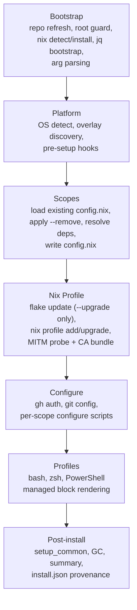
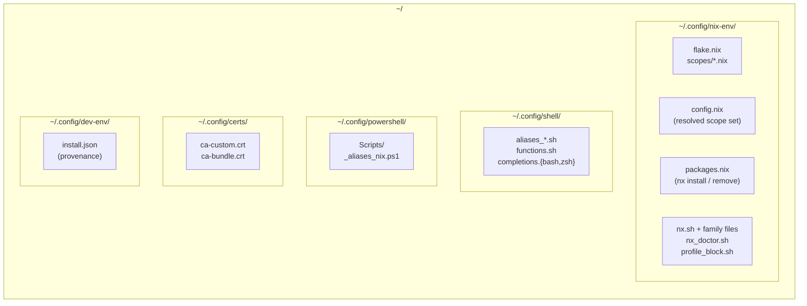
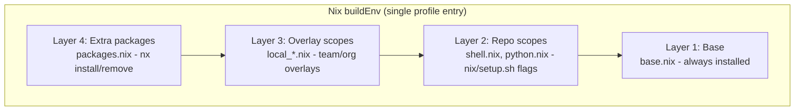
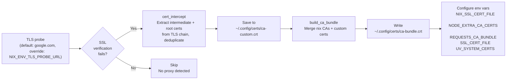
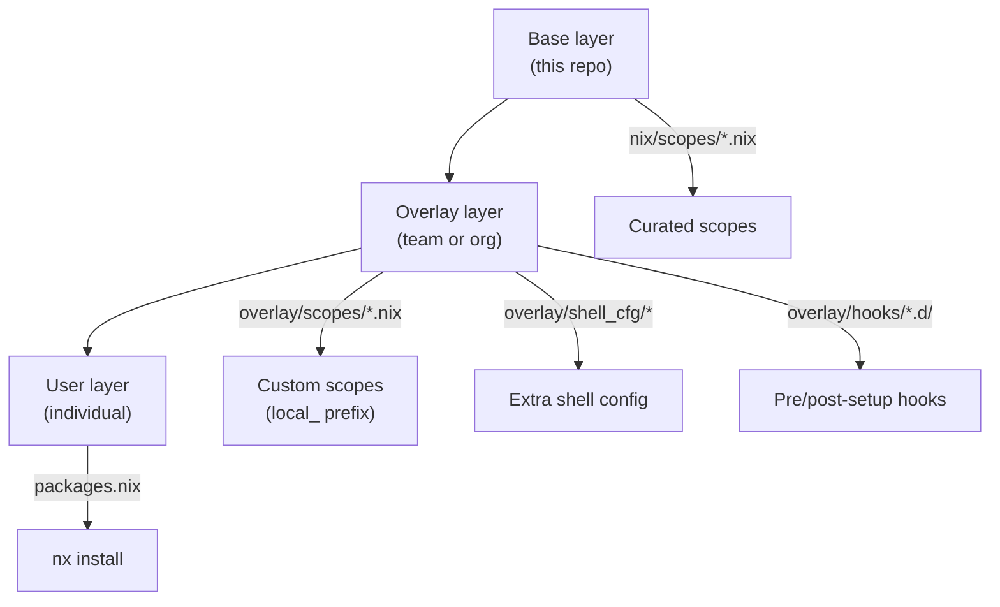

# Architecture

This page explains the design behind the tool - the patterns that make it portable, idempotent, and testable. It is a guided tour for engineers evaluating, adopting, or operating the tool. For exhaustive file tables, recipes, and constraint references aimed at maintainers, see [`ARCHITECTURE.md`](https://github.com/szymonos/envy-nx/blob/main/ARCHITECTURE.md) in the repository root.

## The bootstrapper model

The tool **provisions; it does not run continuously**. One `nix/setup.sh` invocation produces a self-contained environment in `~/.config/nix-env/` and exits. There is no daemon, no agent, no background process, no central server. After setup, the source repository clone is **disposable** - `nx upgrade`, `nx scope`, `nx install`, `nx doctor`, and `nix/uninstall.sh` all operate on `~/.config/nix-env/` without needing the repo.

```mermaid
flowchart LR
    REPO["Source repo
    (cloned or tarball)"] -->|nix/setup.sh| PROV["Provisioning
    7 phases"]
    PROV -->|writes| STATE["~/.config/nix-env/
    + ~/.config/shell/
    + ~/.config/certs/
    + ~/.config/dev-env/"]
    STATE --> CLI["nx CLI
    (daily use, no repo needed)"]
    REPO -.->|safe to delete after setup| X((( )))

    style REPO fill:#1a1a2e,stroke:#16213e
    style PROV fill:#0f3460,stroke:#16213e
    style STATE fill:#16213e,stroke:#16213e
    style CLI fill:#533483,stroke:#16213e
```



This shape has practical consequences for everyday use:

- **Zero operational overhead.** Nothing to monitor, nothing to keep running, no service to restart.
- **Offline after install.** Day-to-day `nx` commands need only the local environment. `nx upgrade` is the one verb that goes to the network, on demand.
- **Clean uninstall.** `nix/uninstall.sh` removes only what the tool created. Generic config (certs, local PATH, third-party shell aliases) is preserved.
- **Disposable repo, durable environment.** Delete the repo, keep working. Re-clone six months later, `nx setup` finds the canonical location automatically.

## Provisioning: the phase pipeline

`nix/setup.sh` is a slim ~110-line orchestrator. All logic lives in **phase libraries** under `nix/lib/phases/`, each independently testable. The orchestrator's only job is sequencing.



Each phase has a single responsibility:

| Phase            | What it solves                                                                                                                   |
| ---------------- | -------------------------------------------------------------------------------------------------------------------------------- |
| **Bootstrap**    | Make the script self-correcting: refresh the repo if behind, install Nix on a bare machine, install `jq` via Nix if it's missing |
| **Platform**     | Detect macOS/Linux differences once, run user-supplied pre-setup hooks                                                           |
| **Scopes**       | Resolve which packages the user wants (flags + auto-detection + overlay), persist to `config.nix`                                |
| **Nix Profile**  | Apply the resolved environment as a single atomic `nix profile add/upgrade`, detect MITM proxies and build the merged CA bundle  |
| **Configure**    | Run per-scope post-install steps (`gh auth login`, `git config`, conda init, terraform install, prompt theme copy, etc.)         |
| **Profiles**     | Write the **managed blocks** into `~/.bashrc`, `~/.zshrc`, and the PowerShell profile                                            |
| **Post-install** | Install non-Nix extras (Copilot CLI, zsh plugins, PowerShell modules), garbage-collect old generations, write `install.json`     |

Re-running setup is **idempotent**: the same flags produce the same output. New flags are additive - adding `--terraform` to an existing install does not remove anything else. `setup.sh --upgrade` is the explicit verb that pulls fresh package versions.

## Durable state: where the environment lives

After provisioning, every piece of state lives under the user's home directory. The repo is a one-time bootstrapper.



| Directory               | What it holds                                           | Survives uninstall? |
| ----------------------- | ------------------------------------------------------- | ------------------- |
| `~/.config/nix-env/`    | Nix environment: flake, scopes, config, `nx` CLI source | No (removable)      |
| `~/.config/shell/`      | Bash/zsh aliases, functions, generated completions      | Partial             |
| `~/.config/powershell/` | PowerShell aliases + nx wrapper                         | Partial             |
| `~/.config/certs/`      | Custom CA + merged bundle (used by all tools)           | Yes (preserved)     |
| `~/.config/dev-env/`    | `install.json` - version, scopes, status, timestamp     | Yes (preserved)     |

The `nx` CLI runs entirely against `~/.config/nix-env/` - no network access, no server dependency, no repository clone required for day-to-day operations. `nx setup` is the one verb that needs the repo (and clones it on demand to a canonical location if missing).

## The `nx` CLI: the daily interface

Nix is powerful but its surface (profiles, generations, closures, flake URIs) is steep. `nx` is a thin layer that wraps the daily verbs in vocabulary developers already know from `apt`, `brew`, and `pip`.

```bash
nx install httpie       # add a package
nx remove httpie        # remove it
nx upgrade              # pull latest of everything
nx rollback             # back out the last change
nx list                 # show every package, annotated by origin
nx search ripgrep       # find a package before installing
```

Beyond package management, `nx` exposes the rest of the system as first-class verbs: `nx scope` (curated bundles), `nx overlay` (team/org customization), `nx pin` (lock nixpkgs to a commit), `nx profile` (managed shell-rc blocks), `nx doctor` (health checks), `nx version` (install provenance), `nx setup` / `nx self update` (re-provision / refresh source).

Internally, `nx.sh` is a small entry point that sources four **family files** by domain - `nx_pkg.sh` (package management), `nx_scope.sh` (scopes/overlay/pin), `nx_profile.sh` (managed blocks), `nx_lifecycle.sh` (setup/self/doctor/version) - plus `nx_doctor.sh` for health checks. Splitting by domain keeps each file focused and makes adding verbs a localized change.

**Tab completion** is generated, not hand-maintained. The user-facing surface (verbs, subverbs, aliases, flags, dynamic completers) is declared once in `.assets/lib/nx_surface.json`. A generator emits bash, zsh, and PowerShell completers from that single source. Adding a flag is a one-file edit; pre-commit hooks (`check-nx-completions`, `check-nx-profile-parity`) defend against drift.

See [The `nx` CLI](nx.md) for the full command reference.

## Package composition: four layers, one profile

Packages assemble bottom-up into a single Nix `buildEnv` profile entry. No layer can shadow or break another.



| Layer              | What                                           | Source                      | Who manages it               |
| ------------------ | ---------------------------------------------- | --------------------------- | ---------------------------- |
| **Base**           | Core tools (git, gh, jq, openssl, vim, ...)    | `nix/scopes/base.nix`       | Always installed             |
| **Repo scopes**    | Curated groups (shell, python, k8s, terraform) | `nix/scopes/<name>.nix`     | `setup.sh` flags             |
| **Overlay scopes** | Custom groups (team CLIs, org utilities)       | `local_*.nix` in scopes dir | `nx scope add` / overlay dir |
| **Extra packages** | Individual tools, ad-hoc                       | `packages.nix`              | `nx install` / `nx remove`   |

All four merge into a single `nix profile upgrade` - one atomic operation, one rollback point. There is no layered priority or shadowing; the flake concatenates them and asks Nix to build the union. Conflict (same binary from two layers) is a build error, surfaced at provisioning time, not at runtime.

This design enables the three customization patterns without forking:

- **Solo developer** - `nx install httpie` adds a package to layer 4, no scope involved.
- **Team** - point `NIX_ENV_OVERLAY_DIR` at a shared git repo with team-specific scopes (layer 3).
- **Organization** - distribute org-wide scopes, hooks, and pinned `nixpkgs` revisions through the same overlay mechanism.

See [Customization](customization.md) for the full guide.

## Managed-block pattern: idempotent profile injection

Every shell configuration tool eventually reaches for `~/.bashrc`. The naive approach - `grep -q 'pattern' || echo 'line' >> ~/.bashrc` - is fragile: it duplicates on re-run if the grep is imperfect, can't update existing entries in place, and leaves orphaned lines after uninstall. This tool uses a **managed block** pattern instead.

Configuration is written between sentinel markers and **fully regenerated** on each run:

```bash
# >>> nix-env managed >>>
# :path
. $HOME/.nix-profile/etc/profile.d/nix.sh
export PATH="$HOME/.nix-profile/bin:$PATH"
export NIX_SSL_CERT_FILE="$HOME/.config/certs/ca-bundle.crt"
# :aliases
. "$HOME/.config/shell/aliases_nix.sh"
# :oh-my-posh
[ -x "$HOME/.nix-profile/bin/oh-my-posh" ] && eval "$(oh-my-posh init bash ...)"
# <<< nix-env managed <<<

# >>> managed env >>>
# :local path
if [ -d "$HOME/.local/bin" ]; then
  export PATH="$HOME/.local/bin:$PATH"
fi
# :certs
export NODE_EXTRA_CA_CERTS="$HOME/.config/certs/ca-custom.crt"
# <<< managed env <<<
```

Two blocks are written to each rc file, with an explicit purpose split:

| Block             | Contents                                             | Removed by uninstall? |
| ----------------- | ---------------------------------------------------- | --------------------- |
| `nix-env managed` | Nix-specific: PATH, nix aliases, completions, prompt | Yes                   |
| `managed env`     | Generic: local PATH, cert env vars, shared functions | No (preserved)        |

The split means **uninstalling Nix-specific config preserves things other tools need**: certificates configured in `managed env` keep working for any future package manager; the `~/.local/bin` PATH addition keeps working for `pip install --user` and similar.

PowerShell uses the same pattern with `#region nix:* / #endregion` markers, managed natively in PowerShell rather than proxied to bash. The `$PROFILE` path and region syntax are PowerShell-specific - implementing them natively keeps each side idiomatic. The user-facing `nx profile` subverb surface stays in sync via a pre-commit parity hook.

Properties:

- **Idempotent** - running setup any number of times produces identical output. CI verifies this on every PR.
- **Updatable** - the block content is replaced atomically, not appended to.
- **Removable** - `nix/uninstall.sh` deletes the block cleanly.
- **Diagnosable** - `nx profile doctor` detects duplicate or missing blocks.

## Corporate proxy and MITM detection

Nix-installed binaries ship with an isolated Mozilla CA bundle - they do **not** consult the macOS Keychain or Linux system CA store. A MITM proxy cert trusted by the OS is invisible to nix tools. Python's `certifi` and Node's built-in CA bundle have the same blind spot. Each ecosystem needs its own configuration.

The setup detects and resolves this automatically:



A single merged CA bundle and a small set of well-known environment variables - set in the `managed env` block - cover every tool ecosystem the project supports. On macOS, certificates are exported directly from the Keychain to capture corporate CAs deployed via MDM. The two helper functions `cert_intercept` and `fixcertpy` are available afterward for ongoing certificate management (new VPN, additional hosts, fresh Python virtualenv).

VS Code Server has a separate problem: it does not source `~/.bashrc`, so shell-profile env vars are invisible to extensions. The setup writes `~/.vscode-server/server-env-setup`, which VS Code Server sources before launching extensions, eliminating `SELF_SIGNED_CERT_IN_CHAIN` errors in GitHub Actions, GitHub Pull Requests, and similar HTTPS-using extensions.

See [Corporate Proxy](proxy.md) for the full operational details.

## Cross-platform consistency

The same setup, the same scopes, and the same `nx` commands work identically across all supported platforms:

| Platform                         | Entry point         | Root required | Notes                                       |
| -------------------------------- | ------------------- | ------------- | ------------------------------------------- |
| macOS (Apple Silicon, Intel)     | `nix/setup.sh`      | One-time      | bash 3.2 path; certs from Keychain          |
| Linux (Debian/Ubuntu/Fedora/...) | `nix/setup.sh`      | One-time      | Optional: `linux_setup.sh` for system prep  |
| WSL                              | `wsl/wsl_setup.ps1` | Windows admin | Provisions distro, then runs `nix/setup.sh` |
| Coder / devcontainers            | `nix/setup.sh`      | None          | Rootless, no daemon                         |

Cross-platform parity is structural, not aspirational. The same `scopes.json` defines the scope catalog for all entry points (parsed natively by bash, PowerShell, and Python). The same `nx` verbs work in every shell. The only platform-specific divergence is *what packages each scope ships*: on Linux the `zsh` scope ships only plugins (zsh comes from the system package manager); on macOS the `zsh` scope ships zsh itself. This is centralized in `phase_scopes_skip_system_prefer` rather than scattered through callers.

## Testability by design

Bash is not commonly thought of as a test-friendly language. This codebase has 600+ test cases across 32 test files because the architecture deliberately enables it.

The key choice: **every side effect is called through a thin wrapper**. Phase functions never call `nix`, `curl`, or external scripts directly - they call `_io_nix`, `_io_curl_probe`, or `_io_run`.

```bash
# nix/lib/io.sh - production wrappers
_io_nix()        { nix "$@"; }
_io_curl_probe() { curl -sS "$@"; }
_io_run()        { "$@"; }
```

Tests redefine these wrappers - three lines, no mocking framework, no PATH manipulation, no subprocess overhead:

```bash
setup() {
  source "$REPO_ROOT/nix/lib/io.sh"
  source "$REPO_ROOT/nix/lib/phases/nix_profile.sh"
  _io_nix() { echo "nix $*" >>"$BATS_TEST_TMPDIR/nix.log"; }
}

@test "nix_profile: apply runs profile upgrade" {
  phase_nix_profile_apply
  grep -q 'nix profile upgrade' "$BATS_TEST_TMPDIR/nix.log"
}
```

This pattern works identically on bash 3.2 (macOS) and bash 5 (Linux). Reading a test shows exactly which commands a phase executes - the test *is* the documentation. Configure scripts are themselves invoked via `_io_run`, so their internal commands are already wrapped at the call site without needing `_io_*` calls inside.

For the parts of the system that can't be unit-tested in isolation, the project layers additional guards:

- **Static hooks** at edit time - `check-bash32`, `check-zsh-compat`, `validate-scopes`, `check-nx-completions`, `check-nx-profile-parity`, ShellCheck.
- **Runtime smoke tests** - `tests/bats/test_nx_zsh.bats` actually sources the `nx` CLI under zsh and exercises every dispatcher path (catches issues no static analyzer can - like the difference between bash and zsh array indexing).
- **Docker integration tests** - `make test-nix` runs the full provisioning pass in a clean container and verifies binaries land on PATH, `install.json` records success, and `nx doctor --strict` passes.
- **CI matrix** - `test_linux.yml` (daemon + rootless) and `test_macos.yml` (Sequoia + Tahoe) run the full setup, verify scope binaries, and assert idempotency on every PR.

Coverage is not measured as a percentage - the policy is "every phase function, every `nx` verb, every doctor check has at least one test." See [Quality & Testing](standards.md) for the full breakdown.

## Bootstrap problem: how `jq` arrives

`scopes.json` is the single source of truth for scope metadata, parsed by three runtimes:

| Consumer   | Parser             |
| ---------- | ------------------ |
| bash       | `jq`               |
| PowerShell | `ConvertFrom-Json` |
| Python     | `json` stdlib      |

JSON is the only format all three parse natively without a custom parser. But on bare macOS, `jq` doesn't exist - and the tool that installs `jq` needs `jq` to resolve the scope set.

The solution is a tiny bootstrap layer:

1. `nix/scopes/base_init.nix` - minimal package list (`jq`, `curl`) included only during bootstrap.
2. `isInit` flag in `config.nix` - set to `true` on the very first run when `jq` is missing.
3. `flake.nix` conditionally includes `base_init.nix` packages when `isInit` is true.
4. First run installs `jq` via Nix, flips `isInit` to false. All subsequent runs find `jq` and skip the bootstrap block entirely.

The total cost is ~13 lines of `setup.sh`, one `.nix` file, and one config flag. It runs once per machine in seconds, then `jq` is an ordinary Nix-managed package. This pattern - a minimal bootstrap layer that becomes invisible after first run - is one of the load-bearing design choices that makes the tool work on a stock macOS shell.

See [Design Decisions → Why JSON as the shared schema format](decisions.md#why-json-as-the-shared-schema-format) for the alternatives that were rejected.

## Bash 3.2 + BSD constraints

macOS ships bash 3.2 as the system default and Apple will not update it (GPLv3 licensing). The setup script must run on a stock macOS - a tool that requires you to already have a setup environment defeats its own purpose.

Concretely, all nix-path scripts must avoid:

| Blocked construct          | Portable alternative                            |
| -------------------------- | ----------------------------------------------- |
| `mapfile` / `readarray`    | `while IFS= read -r; do arr+=(); done < <(...)` |
| `declare -A` (associative) | Space-delimited strings + helper functions      |
| `${var,,}` / `${var^^}`    | `tr '[:upper:]' '[:lower:]'`                    |
| `declare -n` (namerefs)    | Pass variable name as string                    |
| `sed -i ''` (BSD in-place) | Write to temp file + `mv`                       |
| `grep -P` (PCRE)           | `grep -E` or `sed`                              |
| `sed -r`                   | `sed -E`                                        |
| Negative array indices     | `${arr[$((${#arr[@]}-1))]}`                     |

This is **enforced by automation**, not convention - the `check-bash32` pre-commit hook scans every nix-path file for 14 categories of bash 4+ constructs and blocks the commit. The macOS CI workflow validates the same constraints end-to-end on every pull request. Linux-only scripts (`linux_setup.sh`, system installers, system checks) use bash 5 features freely; the constraint applies only to files that run on macOS.

A related constraint applies to files sourced into the user's interactive shell (`shell_cfg/*.sh`, `nx*.sh`, `profile_block.sh`): they must work under both bash and zsh. The `check-zsh-compat` hook enforces this - it auto-recognizes safe `BASH_SOURCE` patterns (default-value, `||` fallback, equality test, guarded blocks) so the rule rarely needs explicit annotations.

## Reproducibility and provenance

Every setup run writes `~/.config/dev-env/install.json`. This single file answers the questions every operations team eventually asks:

- *What version of the tool is installed?*
- *Which scopes is this developer running?*
- *Did the last setup succeed?*
- *When did it run?*
- *Where is the source repo?*

```json
{
  "version": "v1.3.2",
  "entry_point": "nix",
  "scopes": ["shell", "python", "pwsh", "k8s_base"],
  "status": "success",
  "phase": "post_install",
  "platform": "Linux x86_64",
  "user": "me",
  "repo_path": "/home/me/source/repos/szymonos/envy-nx",
  "timestamp": "2026-04-29T14:32:11Z"
}
```

`nx version` reads this file and prints a human-readable summary. Fleet operators can collect `install.json` from each developer machine to build deployment dashboards. The data is structured (JSON), versioned, and written by an `EXIT` trap so it is captured even when setup fails - `status: "failed"` plus `phase: "<where it died>"` is far more actionable than a missing entry.

For coordinated reproducibility across a team, `nx pin set <rev>` locks the entire `nixpkgs` input to a specific commit SHA. Everyone resolves the same package versions until the pin is updated. No shipped `flake.lock` in the repo; the per-user lock in `~/.config/nix-env/flake.lock` gives run-to-run reproducibility on one machine without forcing a single revision on every consumer.

## Customization without forking

The tool is extensible at three levels - without forking the base repository or modifying upstream files:



| Level        | Mechanism                                | Use case                                          |
| ------------ | ---------------------------------------- | ------------------------------------------------- |
| Individual   | `nx install <pkg>` → `packages.nix`      | One-off tools                                     |
| Team         | Shared overlay via `NIX_ENV_OVERLAY_DIR` | Team-specific scopes, aliases, hooks              |
| Organization | Org-managed overlay repo                 | Org standards, pinned revisions, compliance hooks |

Overlay scopes are copied with a `local_` prefix to avoid collisions with base scope names. Hooks (`pre-setup.d/` and `post-setup.d/`) run during `nix/setup.sh` with documented environment variables (`NIX_ENV_VERSION`, `NIX_ENV_PLATFORM`, `NIX_ENV_SCOPES`, `NIX_ENV_PHASE`). A typical organization use case: a `pre-setup.d/pin_nixpkgs.sh` hook writes the org-approved `pinned_rev` so every developer resolves the same `nixpkgs` revision.

See [Customization](customization.md) for the full guide and worked examples.

## Design principles

The choices above are not isolated - they share a small set of principles applied consistently:

- **Bootstrapper, not agent.** Run once, provision, exit. No daemon, no background process, no runtime dependency on infrastructure.
- **Explicit upgrades.** `nix/setup.sh` without `--upgrade` re-applies configuration using existing package versions. Package updates require an explicit `--upgrade` or `nx upgrade`. No silent breakage.
- **Additive scopes.** Adding a scope never removes existing tools. Removal is an explicit action (`setup.sh --remove <scope>`). Scope dependencies are resolved automatically.
- **Tested constraints, not documented conventions.** Bash 3.2 / BSD sed compatibility is enforced by a pre-commit hook. Scope consistency is validated by Python script. Idempotency is verified in CI on every PR. Constraints that depend on humans remembering them eventually drift.
- **Single source of truth for cross-runtime data.** `scopes.json` (catalog) and `nx_surface.json` (CLI surface) are each read by bash, PowerShell, and Python. JSON is the only format all three parse natively without a custom parser.
- **Symmetric, not duplicated.** Bash and PowerShell `nx profile` dispatchers operate on structurally different files (`~/.bashrc` vs `$PROFILE`); each is implemented natively in its own shell. The user-facing surface stays in sync via a parity hook, not by trying to share code that cannot be shared.
- **Disposable source.** The repo is a bootstrapper, not a runtime dependency. After setup, everything needed for day-to-day use lives in `~/.config/nix-env/`.

## Further reading

- [`ARCHITECTURE.md`](https://github.com/szymonos/envy-nx/blob/main/ARCHITECTURE.md) - implementation reference for maintainers (file tables, recipes, constraint reference, hook reference, runtime layout)
- [Design Decisions](decisions.md) - reasoning behind key choices and the alternatives that were rejected
- [The `nx` CLI](nx.md) - full command reference
- [Customization](customization.md) - overlay, hook, scope, and pin guide
- [Corporate Proxy](proxy.md) - certificate detection and configuration flow
- [Quality & Testing](standards.md) - test infrastructure and quality gates
