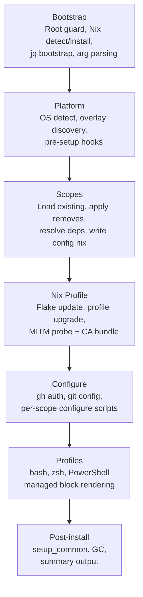
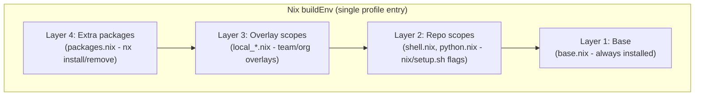
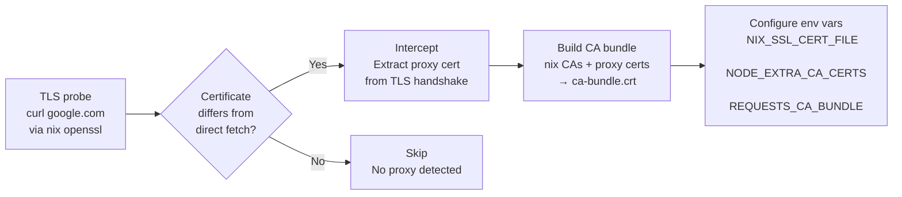
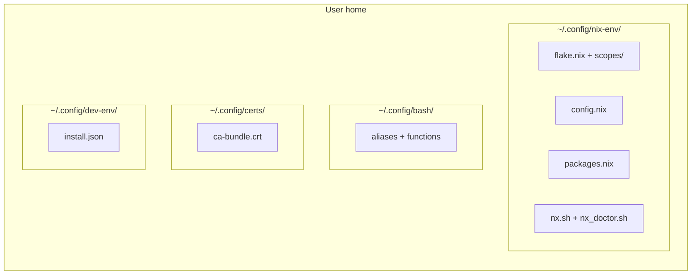

# Architecture

This page explains the design behind the tool - the patterns that make it testable, portable, and maintainable. For exhaustive file tables, call trees, and runtime file locations, see [ARCHITECTURE.md](https://github.com/szymonos/envy-nx/blob/main/ARCHITECTURE.md) in the repository root.

## Phase pipeline

`nix/setup.sh` is a slim orchestrator (~110 lines) that sources phase libraries and executes them in sequence. Each phase is a separate file with documented inputs (`# Reads:`) and outputs (`# Writes:`).



The orchestrator's only job is sequencing. All logic lives in the phase libraries, which makes each phase independently testable and replaceable.

## Testability by design

The architecture's most deliberate choice: every side effect is called through a thin wrapper. Phase functions never call `nix`, `curl`, or `git` directly - they call `_io_nix`, `_io_curl_probe`, or `_io_run`.

```bash
# nix/lib/io.sh - production wrappers
_io_nix()        { nix "$@"; }
_io_curl_probe() { curl -sS "$@"; }
_io_run()        { "$@"; }
```

Tests redefine these wrappers - three lines, no mocking framework, no external dependencies:

```bash
setup() {
  source "$REPO_ROOT/nix/lib/io.sh"
  source "$REPO_ROOT/nix/lib/phases/nix_profile.sh"
  _io_nix() { echo "nix $*" >>"$BATS_TEST_TMPDIR/nix.log"; }
}

@test "nix_profile: apply runs profile upgrade" {
  phase_nix_profile_apply
  grep -q 'nix profile upgrade' "$BATS_TEST_TMPDIR/nix.log"
}
```

This pattern works identically on bash 3.2 (macOS) and bash 5 (Linux). It is self-documenting - reading a test shows exactly which commands a phase executes. No framework to learn, no test infrastructure to maintain.

!!! info "Wrapper boundary"

    The wrappers apply at the **phase boundary** - functions in `nix/lib/phases/` call `_io_nix`, `_io_curl_probe`, etc. Configure scripts (`nix/configure/*.sh`) are called via `_io_run` from the phase layer, so their internal commands are already wrapped at the call site. This avoids double-wrapping without sacrificing testability.

## Package composition

Packages are assembled from four layers, evaluated bottom-up by the Nix flake into a single `buildEnv` profile entry. No layer can shadow or break another.



| Layer          | Source                    | Managed by                  |
| -------------- | ------------------------- | --------------------------- |
| Base           | `base.nix`                | Always installed            |
| Repo scopes    | `shell.nix`, `python.nix` | `nix/setup.sh` flags        |
| Overlay scopes | `local_*.nix`             | `nx scope add`, overlay dir |
| Extra packages | `packages.nix`            | `nx install` / `nx remove`  |

All four layers merge into a single `nix profile upgrade` - one atomic operation, one rollback point.

## Managed block pattern

Shell profile injection uses a **managed block** pattern instead of `grep -q && echo >>` append. This gives idempotent, fully-regenerated, cleanly removable config injection.

Two blocks are written to each rc file (`~/.bashrc`, `~/.zshrc`):

- **`nix-env managed`** - nix-specific: PATH, aliases, completions, prompt init. Removed by `nix/uninstall.sh`.
- **`managed env`** - generic: local PATH, cert env vars, shared functions. Survives uninstall.

```bash
# >>> nix-env managed >>>
# :path
. $HOME/.nix-profile/etc/profile.d/nix.sh
export PATH="$HOME/.nix-profile/bin:$PATH"
export NIX_SSL_CERT_FILE="$HOME/.config/certs/ca-bundle.crt"
# :aliases
. "$HOME/.config/bash/aliases_nix.sh"
# :oh-my-posh
[ -x "$HOME/.nix-profile/bin/oh-my-posh" ] && eval "$(oh-my-posh init bash ...)"
# <<< nix-env managed <<<

# >>> managed env >>>
# :local path
if [ -d "$HOME/.local/bin" ]; then export PATH="$HOME/.local/bin:$PATH"; fi
# :certs
export NODE_EXTRA_CA_CERTS="$HOME/.config/certs/ca-custom.crt"
# <<< managed env <<<
```

PowerShell uses the same concept with `#region nix:*` / `#endregion` blocks, managed natively in PowerShell (not proxied to bash).

!!! tip "Why two blocks?"

    The split means uninstalling nix-env removes only nix-specific config while preserving certificates, local PATH, and generic aliases that other tools may depend on. CI validates this on every PR - assertions verify the nix-env block is gone while the managed-env block is preserved.

## Bootstrap problem

`scopes.json` is the single source of truth for scope metadata - parsed by bash (jq), PowerShell (`ConvertFrom-Json`), and Python (`json` stdlib). JSON was the only format all three parse natively without a custom parser.

But on bare macOS, jq doesn't exist. The tool that installs jq needs jq to resolve scopes. The solution:

1. `base_init.nix` - minimal package list (jq, curl) included only during bootstrap
2. `isInit` flag in `config.nix` - set to `true` on first run when jq is missing
3. `flake.nix` conditionally includes `base_init.nix` when `isInit` is true
4. First run installs jq via Nix, flips `isInit` to false. All subsequent runs find jq and skip bootstrap entirely

The bootstrap is ~13 lines of `setup.sh`, one `.nix` file, and one config flag. It runs once per machine (seconds), then jq is an ordinary Nix package.

## Corporate proxy and MITM detection

Nix-installed binaries ship with an isolated Mozilla CA bundle - they do **not** use the macOS Keychain or Linux system CA store. A MITM proxy cert trusted by the OS is invisible to nix tools.

The tool solves this automatically during setup:



This handles the certificate trust problem for every tool - git, curl, pip, npm, az, terraform, and all nix-built binaries - through a single merged CA bundle and the correct environment variables per framework. On macOS, certificates are exported directly from the Keychain.

See [Corporate Proxy](proxy.md) for the full technical flow including VS Code Server handling.

## Bash 3.2 constraints

All nix-path scripts must work on macOS's system bash (3.2) and BSD sed. This is **enforced by automation**, not convention - the `check-bash32` pre-commit hook blocks commits containing any of 14 categories of bash 4+ constructs:

| Blocked construct          | Portable alternative                            |
| -------------------------- | ----------------------------------------------- |
| `mapfile` / `readarray`    | `while IFS= read -r; do arr+=(); done < <(...)` |
| `declare -A` (associative) | Space-delimited strings with helper functions   |
| `${var,,}` / `${var^^}`    | `tr '[:upper:]' '[:lower:]'`                    |
| `declare -n` (namerefs)    | Pass variable name as string                    |
| `sed -i ''` (in-place)     | Write to temp file + `mv`                       |
| `grep -P` (PCRE)           | `grep -E` or `sed`                              |

macOS CI validates the same constraints at merge time - if a bash 4+ construct slips through, the macOS Sequoia runner catches it.

## Durable state

After setup, all state lives in the user's home directory. The repository clone is disposable.



The `nx` CLI operates entirely on `~/.config/nix-env/` - no network access, no server dependency, no repository clone required for day-to-day operations (`nx install`, `nx upgrade`, `nx doctor`, `nx scope`).

## Design principles

- **Bootstrapper, not agent** - runs once, provisions, exits. No daemon or background process. No runtime dependency on infrastructure.
- **Explicit upgrades** - `nix/setup.sh` without `--upgrade` re-applies config using existing versions. Package updates require explicit `--upgrade` or `nx upgrade`. No silent breakage.
- **Additive scopes** - adding a scope never removes existing tools. Scope dependencies are resolved automatically (e.g., `k8s_dev` pulls in `k8s_base`). Removal is an explicit action.
- **Tested constraints** - bash 3.2 and BSD sed compatibility enforced by pre-commit hook, not convention. Scope consistency validated by Python script. Idempotency verified in CI on every PR.
- **Disposable source** - the repo is a bootstrapper, not a dependency. After setup, everything needed for day-to-day use lives in `~/.config/nix-env/`.

## Further reading

- [ARCHITECTURE.md](https://github.com/szymonos/envy-nx/blob/main/ARCHITECTURE.md) - full implementation reference (file classification, call trees, runtime locations, variable naming conventions)
- [Design Decisions](decisions.md) - reasoning behind key choices (nixpkgs-unstable, dual prompt engines, `set -eo pipefail` without `-u`)
- [Customization](customization.md) - overlay, hook, and scope system guide
- [Corporate Proxy](proxy.md) - certificate detection and configuration flow
