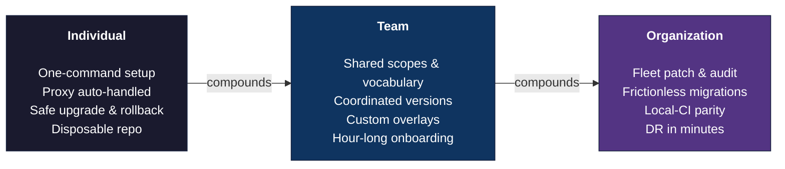

# Benefits at every scale

This tool delivers value at three levels. A single developer gets a reproducible environment that survives hardware changes and proxy rotations. A team gets shared vocabulary, custom overlays, and coordinated package versions. An organization gets a fleet it can patch, audit, and migrate as one. The same underlying property - every user running the same tool against the same scope grammar - produces a different multiplier at each level.



**Universal by design.** Where most developer tooling is platform-specific (Homebrew on macOS, Chocolatey on Windows, system package managers on Linux) or shell-specific (oh-my-zsh, oh-my-bash, PowerShell modules), this tool spans every combination with the same scopes, the same `nx` CLI, and the same configuration:

<div class="grid cards" markdown style="grid-template-columns: repeat(2, 1fr);">

- :fontawesome-brands-apple: **macOS**

    ---

    bash, zsh, PowerShell

- :fontawesome-brands-linux: **Linux**

    ---

    bash, zsh, PowerShell

- :fontawesome-brands-windows: **WSL**

    ---

    bash, zsh, PowerShell

- :material-cloud: **Coder**

    ---

    bash, zsh, PowerShell

</div>

## :bust_in_silhouette: For an individual developer

*Value you get the moment you run setup, regardless of whether anyone else around you uses the tool.*

### One command, full environment

Bootstrapping a development environment from scratch traditionally means installing Homebrew or Chocolatey, then a runtime version manager, then language runtimes, then package managers (uv for Python, bun for JavaScript), then a shell prompt, then the modern CLI baseline (ripgrep, fzf, bat, eza, jq, yq), then completions and aliases for each tool individually. Each install pulls from a different source, has its own update cadence, and needs its own configuration to integrate with the rest.

With this tool, one command does it:

```bash
nix/setup.sh --shell --python --pwsh --k8s-base
```

The repository clone is disposable; everything that matters lives in `~/.config/nix-env/`. You can delete the source tree the day setup completes and the environment keeps working - and from then on, the `nx` CLI manages packages and upgrades without the repo.

### Proxy and certificates handled silently

Without this tool, corporate MITM proxies break almost every HTTPS-using developer tool with cryptic SSL errors. The fix surface is enormous: `git config http.sslCAInfo`, `PIP_CERT`, `npm config set cafile`, `NODE_EXTRA_CA_CERTS`, `REQUESTS_CA_BUNDLE`, `CURL_CA_BUNDLE`, `SSL_CERT_FILE`, `AWS_CA_BUNDLE`, the Azure CLI's own keyring, the gcloud config, terraform's per-provider trust stores. Each tool is a separate diagnostic and a separate fix.

With this tool, the proxy CA is detected at install, merged into a unified trust bundle, and wired into every relevant environment variable. Every tool - git, curl, pip, npm, az, gcloud, terraform, Nix-built binaries, Python's `requests` and `httpx`, Node's `https` module - sees the same trust store. You stop thinking about it. See [Corporate Proxy](proxy.md) for the technical flow.

### Safe upgrades and instant rollback

`nx upgrade` advances all packages to their latest versions in a single atomic generation. If a new release of `kubectl` introduces a regression that breaks your day, `nx rollback` reverts to the previous generation in one command - and `nix profile diff-closures` shows exactly what changed between the two:

```bash
nx upgrade                  # bring everything to latest
nx rollback                 # revert if something breaks
nix profile diff-closures   # see exactly what changed
```

Compare to the typical "did Homebrew just upgrade something?" debugging session, where rolling back a single tool requires hunting a specific version on GitHub and pinning it manually.

### Disposable across machines

New laptop, reformatted disk, fresh Coder workspace - same command, same toolchain, same shell config in under an hour. Your environment stops being something you've slowly accreted over years and becomes something you rebuild from a one-line invocation.

The implication for your own workstation hygiene is significant: factory-resetting a machine stops being a multi-day ordeal, so you do it more often and your machine stays cleaner.

### No tribal knowledge required

Aliases, prompts (oh-my-posh or starship), shell completions, git aliases, tab-completion for `kubectl` and `make`, useful invocations of `eza` and `bat`, sane `git` defaults, and the `nx` CLI itself all come configured out of the box. You inherit a senior engineer's toolbelt - accumulated over a decade of dotfiles iteration - without spending the decade. For developers earlier in their careers, this collapses the "I didn't know that command existed" gap that normally takes years to close.

## :busts_in_silhouette: For a team

*Value that emerges once everyone on the team adopts it - the friction between you and your colleagues largely drops away.*

### Shared vocabulary across the team

Without it, your colleague's environment uses different aliases, a different shell, a different prompt, a different package manager. When pair-debugging, half the time goes to "wait, what's that command?" or "your terminal looks different from mine, what am I looking at?". Cognitive overhead from context-switching between environments is real and recurring.

With it, every team member runs the same `nx` verbs, the same shell aliases, the same prompt. Someone shares their terminal on a screen-share and the layout is immediately legible. Pair sessions stop with environment archaeology and start with the actual problem.

### Onboarding in an hour, not a week

The typical first-week experience for a new engineer: a wiki page with twenty-some install steps, half of which are out of date, three of which have OS-specific caveats, and one of which is "ask the person who originally wrote this." The new hire spends days on prerequisites before writing their first line of code.

With this tool, the wiki page becomes one line - `nx/setup.sh --shell --python --pwsh --k8s-base` plus the team's overlay scope. The new hire is productive the same day. The same property covers contractors, interns, returning hires who left and came back, and anyone else who starts mid-project.

### Custom overlays without forking

Team-specific scopes (your internal CLI tools, your team's preferred linters, service-specific clients), team aliases, and custom setup hooks live in an overlay repo distributed via `NIX_ENV_OVERLAY_DIR`. The overlay layers cleanly on top of the base, so each evolves independently. New base release with security fixes? Pull it without disturbing your overlay. New internal tool the team wants standardized? Add it to the overlay without touching the upstream repo. See [Customization](customization.md) for the full overlay model.

### Coordinated tool versions

`nx pin set <commit>` locks every team member to the same nixpkgs revision. The classic "works on my machine because I'm on terraform 1.6.4 and you're on 1.7.0" scenario stops happening. When the team is ready to move forward, one person updates the pin, sends a message, everyone runs `nx setup`. Pin updates become deliberate, coordinated events instead of silent drift.

### One source of truth for setup docs

For each repo, the README's "getting started" section collapses from three OS-specific subsections (macOS, Linux, WSL) totalling fifty-plus lines of curl/brew/apt/winget invocations to one line: "run `nx setup --<your-team-scope>`, then run `make`". The doc is shorter, easier to keep current, and easier to validate - the maintainer can run it themselves on a fresh machine and confirm it works for everyone.

## :office: For the organization

*Value that appears only at fleet scale - the multipliers a single team cannot achieve alone.*

**This is where the tool's value compounds beyond anything a single team can build on its own.** The individual and team benefits above are real but bounded. A well-maintained personal dotfiles repo produces the same direction of travel for one developer; a disciplined internal wiki produces it for one team. Both scale linearly with the maintenance effort invested in them, and neither survives the boundary that matters most - the boundary between people who built the convention and people who didn't.

The disproportionate returns appear only when the same tool is the default across the entire engineering organization: every team, every department, every employment type, every workstation class. At that point, the same property that quietly helped one developer becomes the lever for fleet-scale operations - patching as a deploy, compliance as a query, migrations as a scope swap. This is where the tool stops being a productivity aid and starts being infrastructure.

### One environment, regardless of who or where

Helping a colleague debug a setup problem today usually starts with a discovery phase: which OS, which shell, which package manager, which version, which proxy configuration. Half the conversation is reconstructing a stranger's environment.

With a single shared tool, that phase disappears. A developer on macOS, a contractor on WSL, and an intern in a Coder workspace all run the same `nx` CLI against the same scope names, with the same shell aliases and the same `~/.config/nix-env/` layout. The platform-specific entry script is the only seam; everything downstream is identical.

| Asymmetry removed                                   | Practical consequence                                                                       |
| --------------------------------------------------- | ------------------------------------------------------------------------------------------- |
| OS and shell                                        | Anyone can pair with anyone over a screen share without context-switching                   |
| Direct employee vs. contractor or vendor            | External staff onboard against the same baseline; no two-tier "your tools, our tools" model |
| Senior vs. junior tooling familiarity               | Aliases, prompts, and `nx` verbs become shared vocabulary, not personal preferences         |
| "I can't help, I don't have your environment" calls | Colleagues can reproduce, then repair, almost any reported issue locally                    |

This is the lowest-visibility benefit and the largest in aggregate. It removes friction from every cross-team conversation indefinitely.

### Workstation disaster recovery

Lost, stolen, dropped, or reformatted laptops are routine operational events at any company with a workstation fleet in the hundreds. Recovery today costs two to three days per incident: the developer reconstructs their toolchain from memory, hunts for lost config, and slowly re-attains productive baseline.

With a shared tool, recovery is one command on a fresh OS install - same scopes, same shell config, same proxy handling, same team overlay. Time-to-baseline drops from days to under an hour. Multiplied by normal attrition and incident rates, this is a defensible productivity figure IT can put on a slide; the same property covers the developer who reformats their machine voluntarily and had previously become their own bottleneck.

### Reproducible enablement events

Internal trainings, workshops, hackathons, and certification courses lose their first 30-90 minutes to prerequisite installation. The instructor cannot validate the setup steps without spinning up multiple clean machines; attendees arrive with partial, inconsistent, or broken toolchains.

With this tool, the prep instruction for any event collapses to a very few commands - one to set up the baseline environment, and optional ones to pull the event-specific overlay.:

```bash
# Terraform on Azure workshop
nx setup --terraform --az
# use the specific terraform version required
tfswitch 1.5.0

# Kubernetes deep-dive
nx setup --k8s-dev
# fetch training cluster credentials
az aks get-credentials --resource-group AZ-RG-AKS001-RG --name aks-cluster-001

# Python data engineering bootcamp
nx setup --python
# sync to the exact versions in the workshop's repo `uv.lock`
uv sync --frozen
```

Specific version requirements stay equally short in the README - a `tfswitch` invocation, a `uv` directive, or a one-off scope distributed via the org overlay for the duration of the event. The instructor can run the entire instruction list on a fresh machine and know it will reproduce identically for every attendee. If it works on the trainer's machine, it works on the trainee's.

The result: enablement events start with content, not troubleshooting.

### Standardizing new tools across the org in one rollout

When a platform, security, or architecture team decides a new tool should become the company standard - a scanner, a linter, a CLI for an internal service - the rollout today involves an RFC, per-OS installation guides, a wiki page, and a Slack thread that absorbs support load for months. Adoption stays partial because the friction is real.

With shared scopes, the rollout is two steps:

1. Add the tool to the relevant scope (`nix/scopes/<scope>.nix` or its overlay equivalent).
2. Send a single message: *"Run `nx setup --<scope>` to pick up the new standard tooling."*

Every developer ends up on the same Nix-pinned version. There is no per-platform installer doc, no Apple Silicon caveat, no "I tried but the proxy blocked me" thread. Standards become deployments rather than negotiations.

### Tool migrations and replacements without user friction

The compounding case: a tool already in wide use must be replaced - for licensing, security, deprecation, or strategic reasons. Concrete recent example: Miniconda's commercial-use restrictions push organizations toward Miniforge.

Done by hand, that migration is a multi-quarter program. Every developer has to read a migration guide, uninstall one tool, install another, port their existing environments, and almost certainly break at least one project on the way. Many simply don't do it. The org carries both tools in parallel for years.

Done through this tool:

1. Swap the package in the affected scope.
2. Ship a migration hook (`pre-setup.d/` or `post-setup.d/`) that performs the data migration - moving environments, rewriting shell init blocks, removing the legacy install.
3. Announce: *"Run `nx setup`."*

Atomic Nix profiles mean the cutover is reversible per user via `nx rollback` if a team hits an edge case. The migration becomes a routine deploy rather than a license-deadline-driven crisis.

The general principle: tool decisions are no longer entrenched by switching cost. Legal, security, and cost-driven swaps become operational changes instead of transformation programs.

### Vulnerability response becomes a deploy

When a CVE lands on something embedded everywhere - curl, git, openssl, jq, or any of the dozens of transitive dependencies pulled in by Nix-built binaries - the org-wide patching exercise today is a multi-week coordination effort with a long tail of unpatched stragglers. The exposure window is measured in weeks of uncertainty, and there is no clean way to answer "are we done patching yet?".

With shared scopes and a shared pin, the response collapses to the same flow as a routine tool migration: security bumps the pinned commit, sends one message, the fleet patches as developers run `nx setup`. `install.json` provenance answers the "are we done?" question by reporting which machines still hold the old pin. The exposure window stops being a campaign and becomes a measurable SLA.

### Continuous license and inventory visibility

Compliance, procurement, and InfoSec routinely spend real headcount answering questions like: which dev machines have HashiCorp Terraform installed since the BUSL change, are we using anything GPL-licensed, how many developers are still on the deprecated Foo CLI two quarters after we asked them to migrate. Those answers are normally survey-driven and stale by the time they're collected.

`install.json` plus the scope manifests answer those questions structurally. New license restrictions can be evaluated centrally before a single developer is affected. Procurement can renegotiate or drop subscriptions for tools that scope data shows aren't actually in use - a real and recurring source of waste.

### AI coding assistants get more reliable

AI coding tools - Claude Code, Cursor, Copilot - increasingly assume specific tool surfaces: `rg` instead of `grep`, `fd` instead of `find`, `gh` for GitHub operations, `uv` for Python, `bun` for JavaScript. When developers have inconsistent toolchains, those assumptions silently degrade: the model proposes a one-liner, the developer gets `command not found` and falls back to a slower path or a different tool entirely.

A standardized toolbelt makes AI suggestions land more often, and lets prompt-engineering investments (CLAUDE.md files, agent definitions, slash commands) be written against a known surface. As AI assistants account for an increasing share of engineering output, this benefit grows from incidental to load-bearing.

### Synergy at company-wide adoption

Every benefit above scales with adoption density. Each marginal team that adopts the standard makes the standard slightly more valuable to all existing adopters - because the friction the tool removes is friction *between* people, and friction between people only disappears when both sides have the same baseline.

At partial adoption, you get partial returns. At full coverage across the engineering organization, three properties appear that no smaller scale can produce:

- **Cross-team mobility approaches zero cost.** When an engineer moves from one team to another, the environment doesn't change. Onboarding into a new project becomes a single overlay swap, not a workstation reset.
- **Contractor and vendor onboarding becomes a one-liner.** Every external engagement starts with the same setup command; the standard travels with the contractor between engagements rather than being re-explained at each one.
- **The convention stops needing evangelism.** At critical mass, the next new hire doesn't need to be taught `nx`; they walk in already knowing it the way they know `git`. The tool becomes invisible infrastructure - the kind people only notice when it isn't there.

This is the asymptote. The first team to adopt pays most of the cost; the hundredth pays almost nothing and inherits everything the previous ninety-nine unlocked.

## Why wider adoption multiplies the value

Each benefit above is unlocked by a single underlying property: every user is running the same tool, with the same scope grammar, against the same overlay distribution mechanism. That property is worth little to one developer, valuable to one team, and transformative at organizational scale - because the value of standardization scales with the number of people who share it.

A pilot team will see modest setup-time savings. A standardized organization will see entire categories of cost disappear: workstation recovery time, CI flake debugging, event prep, the change-management overhead of tool standardization and migrations, vulnerability exposure windows, and the survey-driven scramble that produces compliance answers.

## Dig deeper

- **[Enterprise Readiness](enterprise.md)** - maturity assessment, what's production-ready today, what needs investment, adoption path
- **[Architecture](architecture.md)** - phase-separated orchestrator, durable state model, design principles
- **[Customization](customization.md)** - three-tier overlay system for team- and org-specific scopes
- **[Corporate Proxy](proxy.md)** - full technical flow for MITM detection and trust-store configuration
