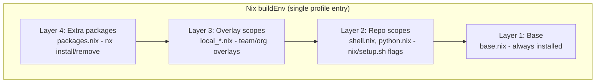

# Customization

The tool is designed for customization at three levels - from individual developers adding a package to organizations distributing standardized environments - without forking the base repository.

## Package layers

Packages are assembled from four layers, evaluated bottom-up by the Nix flake. All layers merge into a single `buildEnv` - one nix profile entry, one `nix profile upgrade` to apply. No layer can shadow or break another.



| Layer              | What                                           | How                                 | Who        |
| ------------------ | ---------------------------------------------- | ----------------------------------- | ---------- |
| **Base**           | Core tools (git, jq, curl, coreutils)          | Always included, cannot be disabled | Base repo  |
| **Repo scopes**    | Curated groups (shell, python, k8s, terraform) | `nix/setup.sh --shell --python`     | Base repo  |
| **Overlay scopes** | Custom groups (team CLIs, org utilities)       | `nx scope add` or overlay directory | Team / org |
| **Extra packages** | Individual tools                               | `nx install httpie`                 | Individual |

## Adding packages (layer 4)

The simplest way - no scopes, no files to edit:

```bash
nx install httpie jq       # validates against nixpkgs, installs immediately
nx remove httpie           # remove a package
nx list                    # see everything installed, annotated by layer
```

Package names are validated against nixpkgs before being added. Typos and non-existent packages are caught immediately. Changes apply without needing `nx upgrade`.

Use this for one-off tools. If you find yourself adding many related packages, consider creating a scope instead.

## Creating custom scopes (layer 3)

Scopes group related packages with a meaningful name:

```bash
# Create a scope and add packages in one step
nx scope add devtools httpie jq bat

# Add more packages to an existing scope
nx scope add devtools fd

# Open a scope in your editor
nx scope edit devtools

# Apply changes after manual edits
nx upgrade
```

The scope file is standard Nix:

```nix
{ pkgs }: with pkgs; [
  bat
  fd
  httpie
  jq
]
```

Scopes created via `nx scope add` live in the overlay directory and are copied into `~/.config/nix-env/scopes/` with a `local_` prefix - preventing name collisions with base repo scopes.

### Packages that are not in nixpkgs

A scope file is an ordinary Nix function: it takes `pkgs` and returns a list of
derivations. The flat package list is only the shape `nx scope add` writes - it
is not a restriction. You can build a derivation inline and return that, which
is how an overlay ships a tool nixpkgs does not carry without changing this
repo.

This example installs a prebuilt release binary, so it costs a download instead
of a source build:

```nix
{ pkgs }:
let
  version = "0.28.4";
  sofka = pkgs.stdenvNoCC.mkDerivation {
    pname = "sofka";
    inherit version;
    src = pkgs.fetchurl {
      url = "https://github.com/nklmilojevic/sofka/releases/download/v${version}"
        + "/sofka-v${version}-x86_64-unknown-linux-musl.tar.gz";
      sha256 = "72b5b56afc3cb021d5233a63b6d252a4b8375c420a887da1e58be803cafdae0b";
    };
    sourceRoot = ".";
    installPhase = ''
      runHook preInstall
      install -Dm755 sofka "$out/bin/sofka"
      runHook postInstall
    '';
  };
in
[ sofka ]
```

Things worth knowing:

- Prefer a statically linked release asset - a `musl` build on Linux. A
  dynamically linked binary also needs `pkgs.autoPatchelfHook` in
  `nativeBuildInputs` and its shared libraries in `buildInputs`.
- `sourceRoot = "."` is for a flat archive that has no top-level directory.
- This example pins one platform. To cover several, look the URL and hash up in
  an attribute set keyed on `pkgs.stdenv.hostPlatform.system`.
- `nx scope add` cannot add such a package, because it checks every name
  against nixpkgs. Create the scope with `nx scope add <name>`, then write the
  derivation with `nx scope edit <name>`.
- After a scope file contains hand-written Nix, `nx scope add <name> <pkg>`
  refuses to touch it. That command rebuilds the file from package names alone
  and would discard everything else. Edit the file directly instead.

## Overlay directory

The overlay directory is where custom scopes and shell configs live. It supports three usage patterns:

| Pattern        | Overlay location                           | Use case                        |
| -------------- | ------------------------------------------ | ------------------------------- |
| Solo developer | `~/.config/nix-env/local/` (default)       | Personal tools and aliases      |
| Team           | Shared git repo via `NIX_ENV_OVERLAY_DIR`  | Team-specific scopes and config |
| Organization   | Org-managed repo via `NIX_ENV_OVERLAY_DIR` | Org-wide scopes and config      |

Only one overlay directory is active at a time. `NIX_ENV_OVERLAY_DIR` **replaces**
`~/.config/nix-env/local/`, it does not add to it. If the new overlay has a
`scopes/` directory, the next `nix/setup.sh` run removes every synced `local_*.nix`
copy it does not contain, which drops your personal overlay scopes from the build.
An overlay without `scopes/` removes nothing, so the old copies keep building. The sources under
`~/.config/nix-env/local/scopes/` are left untouched - unset the variable to get
them back. Personal *packages* are unaffected either way: `nx install` writes to
`packages.nix`, which the overlay sync never touches.

### Structure

```text
overlay-dir/
├── scopes/                       # custom scope files (copied as local_*.nix)
│   └── devtools.nix
└── shell_cfg/                    # extra shell config (sourced on login)
    └── aliases_custom.sh
```

- **Scopes** are copied with `local_` prefix during `nix/setup.sh` or `nx scope add`
- **Shell configs** in `shell_cfg/` are sourced alongside standard configs at login
- **Hooks** cannot be shipped in an overlay - a `hooks/` folder there is ignored. See [Hooks](#hooks).

### Sharing with a team

Keep the overlay in a shared git repo. Each team member then runs these steps once:

```bash
git clone https://github.com/<org>/team-nix-overlay ~/src/team-nix-overlay

# In ~/.bashrc or ~/.zshenv, before the managed block
export NIX_ENV_OVERLAY_DIR="$HOME/src/team-nix-overlay"

nx setup    # copies the overlay's scopes in as local_<name>.nix
```

Setup copies the scopes but does not enable them - `nx scope add` only registers a
scope it creates itself. Enable each one by adding `"local_<name>"` to the `scopes`
list in `~/.config/nix-env/config.nix`, then build:

```bash
nx upgrade
```

To pick up changes later, `git pull` in the overlay and run `nx setup` again;
`nx upgrade` alone rebuilds from the copies without syncing them. This manual flow
is a known gap - [`design/overlay_catalog.md`](https://github.com/szymonos/envy-nx/blob/main/design/overlay_catalog.md)
proposes a one-command `nx overlay add` that replaces it.

The shared repo can contain team-specific scopes and shell aliases. Individual users can still use `nx install` for personal additions on top.

### Managing overlays

```bash
nx overlay list      # show overlay directory contents
nx overlay status    # show sync status (synced / modified / source missing)
```

## Hooks

Hook scripts (`*.sh`) run at defined phases during `nix/setup.sh`, with access to environment variables.
Hooks are local to one machine: setup reads hooks only from `~/.config/nix-env/hooks/`. An overlay cannot ship
them - a `hooks/` folder in an overlay directory is ignored. Running a team's scripts inside every setup
is the riskiest thing an overlay could do, so it stays out until a concrete need for it appears.

| Phase      | Directory                               | Variables available                              |
| ---------- | --------------------------------------- | ------------------------------------------------ |
| Pre-setup  | `~/.config/nix-env/hooks/pre-setup.d/`  | `NIX_ENV_VERSION`, `NIX_ENV_PLATFORM`, `ENV_DIR` |
| Post-setup | `~/.config/nix-env/hooks/post-setup.d/` | All above + `NIX_ENV_SCOPES`                     |

Example use cases:

- **VPN check** - verify VPN is connected before setup downloads packages
- **Fleet telemetry** - POST `install.json` to a monitoring endpoint after setup
- **Team pinning** - write `pinned_rev` to lock package versions across a team
- **Compliance** - verify required scopes are present, block setup if missing

## Pinning package versions

By default, `nx upgrade` resolves the latest `nixpkgs-unstable` - a deterministic snapshot of 100k+ packages at specific versions. Each commit is a reproducible state, not a rolling release.

For teams that need coordinated versions:

```bash
nx upgrade           # upgrade and verify everything works
nx pin set           # pin the current (tested) revision
nx pin show          # show current pin
nx pin remove        # go back to latest unstable
```

The pin is stored in `~/.config/nix-env/pinned_rev`. When present, `nx upgrade` locks to that commit instead of resolving the latest. Set the pin from a pre-setup hook on each machine (placed there by your device management, for example):

```bash
# ~/.config/nix-env/hooks/pre-setup.d/pin_nixpkgs.sh
echo "abc123..." > "$HOME/.config/nix-env/pinned_rev"
```

When IT validates a new nixpkgs revision, they update the hook - every machine gets the tested baseline on its next setup run.

## Upgrades and rollback

```bash
nx upgrade                    # upgrade all packages to latest (or pinned) versions
nx rollback                   # revert to the previous package set
nix profile diff-closures     # see exactly what changed
nx gc                         # clean up old generations
```

Upgrades are atomic - all packages upgrade together through a single `buildEnv`. Rollback reverts the entire environment to the previous state, not individual packages. This eliminates partial upgrade states.

## Quick reference

| Task                         | Command                              |
| ---------------------------- | ------------------------------------ |
| Add a package                | `nx install <pkg>`                   |
| Remove a package             | `nx remove <pkg>`                    |
| List all packages            | `nx list`                            |
| Search nixpkgs               | `nx search <term>`                   |
| Create a scope with packages | `nx scope add <name> <pkg> [pkg...]` |
| Edit a scope file            | `nx scope edit <name>`               |
| Show scope tree              | `nx scope tree`                      |
| List overlay contents        | `nx overlay list`                    |
| Check overlay sync status    | `nx overlay status`                  |
| Upgrade packages             | `nx upgrade`                         |
| Pin current revision         | `nx pin set`                         |
| Show / remove pin            | `nx pin show` / `nx pin remove`      |
| Roll back last upgrade       | `nx rollback`                        |
| See what changed             | `nix profile diff-closures`          |
| Clean up old generations     | `nx gc`                              |
| Run health checks            | `nx doctor`                          |
