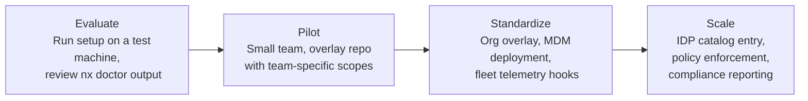

# Enterprise Readiness

An assessment of where this tool stands today, what it provides out of the box, and what would need investment for organizational adoption.

## Maturity scale

| Level         | Meaning                                                                             |
| ------------- | ----------------------------------------------------------------------------------- |
| **Available** | Implemented, tested, documented. Works out of the box for the stated use case.      |
| **Partial**   | Core functionality exists but has known gaps or caveats noted in the detail column. |
| **Stub**      | Extension point or data format exists; consumer or implementation is downstream.    |
| **Missing**   | Not implemented. Would require new development.                                     |

## Maturity summary

| Dimension          | Rating    | Detail                                                                                             | Citation                                                          |
| ------------------ | --------- | -------------------------------------------------------------------------------------------------- | ----------------------------------------------------------------- |
| Code quality       | Available | Bats + Pester test suites, custom pre-commit hooks, ShellCheck, multi-platform CI                  | `tests/bats/`, `tests/pester/`, `.pre-commit-config.yaml`         |
| Architecture       | Available | Phase-separated orchestrator, testable via wrapper overrides, documented call tree                 | `ARCHITECTURE.md`, `nix/lib/io.sh`                                |
| Cross-platform     | Available | macOS (bash 3.2 + BSD), Linux, WSL, Coder all CI-validated                                         | `.github/workflows/test_linux.yml`, `test_macos.yml`              |
| Documentation      | Available | ARCHITECTURE.md, CONTRIBUTING.md, SUPPORT.md, mkdocs site, inline design rationale                 | `docs/`, `ARCHITECTURE.md`, `CONTRIBUTING.md`                     |
| Corporate proxy    | Available | Automatic MITM detection, CA bundle merging, per-tool env var configuration                        | `nix/lib/phases/nix_profile.sh`, `docs/proxy.md`                  |
| Extensibility      | Available | Three-tier overlay model (base, overlay, user), hook system, custom scopes                         | `nix/lib/phases/platform.sh`, `docs/customization.md`             |
| Upgrade/rollback   | Available | Atomic upgrades via Nix profiles, `nx rollback`, `nx pin` for version coordination                 | `.assets/lib/nx.sh`, `tests/bats/test_nx_commands.bats`           |
| Release pipeline   | Available | Tagged releases with tarball, SBOM, cosign signing, CHANGELOG enforcement                          | `.github/workflows/release.yml`, `.assets/tools/build_release.sh` |
| Fleet telemetry    | Stub      | `install.json` provenance and `nx doctor --json` provide data; consumer not included               | `.assets/lib/install_record.sh`, `.assets/lib/doctor.sh`          |
| MDM integration    | Stub      | `--unattended` mode works; Determinate Systems provides macOS MDM installer; no packaging included | `nix/setup.sh --unattended`                                       |
| E2e testing        | Partial   | Linux and macOS validated in CI; WSL covered by mocked Pester tests, no real WSL2 guest in CI      | `tests/pester/WslSetup.Tests.ps1`, `.github/workflows/`           |
| Policy enforcement | Missing   | Hook directories (`pre-setup.d/`, `post-setup.d/`) exist as extension points; no enforcement logic | `nix/lib/phases/platform.sh`                                      |

## What's production-ready today

### Self-contained environment lifecycle

The complete install → configure → upgrade → rollback → uninstall lifecycle works without external dependencies:

- `nix/setup.sh` provisions the environment (one command, idempotent)
- `nx upgrade` / `nx rollback` manage package versions
- `nx doctor --strict` validates environment health
- `nix/uninstall.sh` cleanly removes everything (two-phase: environment-only or full Nix removal, with `--dry-run` preview). CI-validated on every PR - assertions verify that nix-specific config is removed while generic config is preserved

### Organizational customization without forking

The overlay system supports three levels of customization:

- **Base layer** - curated scopes shipped with this repository
- **Overlay layer** - organization or team scopes, shell config, and hooks distributed via `NIX_ENV_OVERLAY_DIR`
- **User layer** - individual packages via `nx install`

An organization can maintain its own overlay repository with custom scopes (internal CLI tools, team-specific packages), shell aliases, and setup hooks - without modifying the base repository. Base updates are pulled independently of overlay changes.

### IDP integration surface

The tool provides building blocks that an Internal Developer Platform can consume:

| Building block     | What it provides                                                | How an IDP consumes it                             |
| ------------------ | --------------------------------------------------------------- | -------------------------------------------------- |
| Version identity   | `NIX_ENV_VERSION`, git tags, `VERSION` file in release tarballs | Catalog entity metadata                            |
| Health checks      | `nx doctor --json`                                              | Monitoring endpoint, fleet health dashboard        |
| Install provenance | `install.json` (version, scopes, timestamp, status)             | Audit trail, compliance reporting                  |
| Hook directories   | `pre-setup.d/`, `post-setup.d/`                                 | Org policy injection without forking               |
| Overlay mechanism  | `NIX_ENV_OVERLAY_DIR`                                           | Scope and config distribution                      |
| Env var namespace  | `NIX_ENV_*` reserved for extensions                             | Enterprise-specific configuration                  |
| Unattended mode    | `--unattended` flag                                             | MDM deployment, Ansible playbooks, Coder templates |

### Certificate and proxy handling

Automatic MITM proxy detection and certificate configuration is production-ready and tested. See [Corporate Proxy](proxy.md) for the full technical flow.

### Release pipeline

Every tagged release produces a signed tarball, SBOM (`sbom.spdx.json`), closure manifest (`closure.txt`), and SHA-256 checksums. Artifacts are signed with cosign keyless signing (OIDC-based) and verifiable with `cosign verify-blob`. See [Releasing](releasing.md) for the full pipeline.

## Value at organizational scale

Most of the value documented above accrues to a single developer: their setup is faster, their environment is reproducible, their proxy works. Those benefits are real but bounded - they would be matched by any well-maintained personal dotfiles repo.

The disproportionate returns appear when the same tool is the default across teams, departments, and employment types. At that point, the same property - every developer running the same tool against the same scope grammar - becomes the lever for fleet-scale operations:

| Benefit                                      | Mechanism                                                       |
| -------------------------------------------- | --------------------------------------------------------------- |
| One environment regardless of OS or role     | Same `nx` CLI, same scopes, same aliases on every platform      |
| Workstation disaster recovery in minutes     | One command on a fresh OS reproduces the prior environment      |
| Local-to-CI environment parity               | CI runners provisioned from the same scopes and pin as dev      |
| Reproducible enablement events               | Single-command prep that the trainer can validate end-to-end    |
| Tool standardization and migration as deploy | Scope edit + migration hook + `nx setup`                        |
| Patch and audit as a fleet, not a survey     | Pin bump + `install.json` provenance answers compliance queries |
| AI coding assistants get more reliable       | Standardized tool surface for `rg`, `fd`, `gh`, `uv`, `bun`     |

See **[Benefits at every scale](benefits.md)** for the full prose treatment, including the individual and team levels.

## What needs enterprise investment

### Nix approval (strategic, highest impact)

Nix is the foundational dependency. Before organizational adoption, InfoSec and platform teams need to evaluate:

- **Supply chain:** packages come from `nixpkgs-unstable`, a community-maintained repository. Nix provides reproducible builds and content-addressable storage, but the upstream is not vendor-managed.
- **Network requirements:** Nix downloads from `cache.nixos.org` (binary cache). Air-gapped environments need a local cache or binary mirror.
- **MDM compatibility:** [Determinate Systems](https://determinate.systems/nix/macos/mdm/) provides a commercially supported installer with Jamf/Intune integration - the tool already uses their installer as the recommended method.

**Mitigation:** `nx pin set <rev>` locks all packages to a specific nixpkgs commit SHA. Distributed via overlay hooks, this ensures every developer runs identical, audited package versions. The pin mechanism is already implemented and CI-tested.

### Fleet telemetry

The building blocks exist (`install.json` for provenance, `nx doctor --json` for health), but the consumer - the system that collects, aggregates, and dashboards this data - is an enterprise infrastructure concern. Options:

- **Lightweight:** Post-setup hook that `curl`s provenance to an internal endpoint
- **Full:** Scheduled `nx doctor --json` output to a monitoring system (Datadog, Grafana)

The hook system (`post-setup.d/`) provides the injection point. The telemetry endpoint and data contract are decisions for the platform team.

### Policy enforcement

The overlay hook system provides the mechanism (code runs at defined phases with access to environment variables). Example policies an organization might enforce:

- Minimum tool versions
- Required scopes for specific teams
- Mandatory proxy certificate configuration
- Package allowlists or blocklists

No enforcement logic is included. The mechanism exists; the rules belong in the organization's overlay repository.

### Distribution

The tool is distributed via git clone and release tarballs. For enterprise deployment, additional channels may be needed:

- **Artifact store** - upload signed tarballs to Artifactory, Nexus, or equivalent
- **MDM scripts** - wrapper scripts for Jamf/Intune that handle the initial Nix install + setup invocation
- **Coder templates** - pre-configured dev container definitions that run setup on workspace creation

See [Releasing](releasing.md) for tarball verification and artifact details.

## Risks and mitigations

| Risk                                              | Severity | Mitigation                                                                                                            |
| ------------------------------------------------- | -------- | --------------------------------------------------------------------------------------------------------------------- |
| Nix not approved by InfoSec                       | High     | Determinate Systems commercial support; `nx pin` for supply chain control; content-addressable store for auditability |
| nixpkgs-unstable drift                            | Medium   | `nx pin set <rev>` locks versions; explicit `--upgrade` required; no silent updates                                   |
| Cognitive load (macOS + WSL + Coder + bash 3.2/5) | Medium   | Phase-separated architecture; each phase independently testable; comprehensive ARCHITECTURE.md                        |
| External GitHub fetch at install time             | Medium   | Release tarballs for air-gapped use; overlay for internal mirrors                                                     |
| WSL not e2e-tested                                | Medium   | 61 Pester tests cover orchestration logic with mocked `wsl.exe`; real WSL behavior not validated in CI                |
| Single-maintainer project                         | Medium   | Comprehensive test suite, CI gates, and documentation reduce bus factor                                               |
| macOS MDM conflicts with Nix                      | Low      | Determinate Systems MDM installer designed for managed fleets                                                         |

## Adoption path

Each stage is independently valuable. A single developer benefits from the setup automation. A team benefits from shared scopes and overlays. The organization benefits from fleet visibility and policy enforcement. The tool does not require full organizational commitment to deliver value at each stage.
