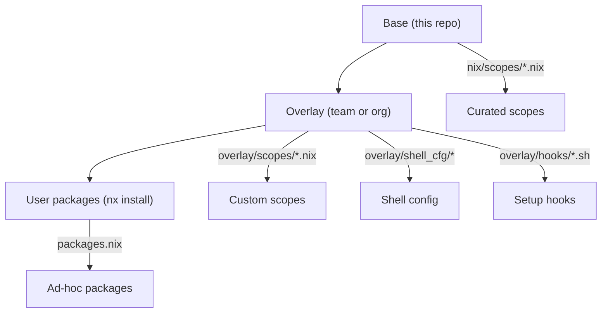

# Dev Environment Setup

Your development environment works today. It will break the day you switch to a new machine, connect to a different network, rotate a certificate, or onboard a teammate who needs the same setup you spent a week assembling from memory. The tools are installed - but are they reproducible? Can you roll them back? Can you prove to anyone what version of what is running where?

This tool turns a developer workstation into managed infrastructure. One command provisions a complete, versioned environment across macOS, Linux, WSL, and Coder. Everything is declarative, upgradeable with rollback, and cleanly uninstallable. Corporate proxy certificates are detected and configured automatically - across Nix, Python, Node.js, and every other framework that has its own trust store.

```bash
nix/setup.sh --shell --python --pwsh --k8s-base
```

After setup, the repository clone is disposable. All state lives in `~/.config/nix-env/`, managed by the built-in `nx` CLI:

!!! tip "Day-to-day usage"

    ```bash
    nx install httpie       # add a package
    nx upgrade              # upgrade all packages
    nx rollback             # revert if something breaks
    nx doctor               # run health checks
    ```

## Why this exists

Large engineering organizations without a standard approach to developer workstation setup experience a predictable set of problems:

- **Inconsistent tooling** - developers install tools manually, from different sources, at different versions. "Works on my machine" is a daily conversation. Linting tools, pre-commit hooks, and Makefiles - the building blocks of code quality - remain a rarity because there is no baseline that includes them.

- **SSL/TLS certificate failures** - corporate MITM inspection proxies replace upstream certificates. Every tool that makes HTTPS requests (git, curl, pip, npm, az, terraform) breaks with cryptic SSL errors. Developers lose hours on workarounds that are fragile and tool-specific. See [Corporate Proxy](proxy.md) for how this tool solves it.

- **Platform fragmentation** - some teams use macOS, others run Linux in WSL, cloud environments add a third variant. Each platform has its own package manager, shell configuration conventions, and trust store. Supporting all three is expensive and rarely attempted.

- **No reproducibility** - onboarding a new developer takes hours of manual setup. Rebuilding after a hardware failure repeats the same effort. There is no way to audit what is installed, no rollback path when an upgrade breaks something, and no mechanism to coordinate package versions across a team.

## What it provides

### :package: Standards out of the box

Every installation includes a curated baseline: git with sane defaults, shell aliases, pre-commit tooling, Makefile completion, and consistent shell configuration across bash, zsh, and PowerShell. Teams that adopt this tool inherit a shared vocabulary of commands, aliases, and workflows without additional effort.

### :lock: Transparent proxy and certificate handling

Corporate proxy issues are detected and resolved automatically during setup. The tool intercepts MITM proxy certificates, builds a merged CA bundle, and configures every tool that needs it - git, curl, pip, npm, az, terraform, and nix-built binaries - through the correct environment variables. On macOS, certificates are exported directly from the Keychain. See [Corporate Proxy](proxy.md) for the full flow.

### :globe_with_meridians: Cross-platform consistency

The same tool, the same scopes, and the same `nx` commands work identically across all supported platforms. Developers switch platforms without learning a new setup process. Teams standardize on a shared configuration regardless of hardware preferences.

| Platform                                       | Entry point         | Root required            | Shell support         |
| ---------------------------------------------- | ------------------- | ------------------------ | --------------------- |
| macOS (Apple Silicon, Intel)                   | `nix/setup.sh`      | One-time for Nix install | bash, zsh, PowerShell |
| Linux (Debian, Ubuntu, Fedora, RHEL, openSUSE) | `nix/setup.sh`      | One-time for Nix install | bash, zsh, PowerShell |
| WSL (Windows Subsystem for Linux)              | `wsl/wsl_setup.ps1` | Windows admin            | bash, zsh, PowerShell |
| Coder / devcontainers                          | `nix/setup.sh`      | None (rootless)          | bash, zsh, PowerShell |

### :repeat: Declarative and reproducible

The entire environment is defined in Nix scope files - plain text that can be version-controlled, code-reviewed, and audited. `nx pin` coordinates package versions across a team by locking to a specific nixpkgs commit. Every installation writes provenance metadata to `install.json`, enabling fleet-wide visibility into what is deployed where.

### :shield: Safe upgrades, rollback, and clean uninstall

`nx upgrade` pulls the latest packages. `nx rollback` reverts to the previous generation if something breaks. `nix profile diff-closures` shows exactly what changed. When the tool is no longer needed, `nix/uninstall.sh` cleanly removes everything it created - nix-specific shell config, aliases, plugins, state directories - while preserving generic configuration (certificates, local PATH) that other tools may depend on. A `--dry-run` flag previews all changes before committing. The entire lifecycle - install, upgrade, rollback, uninstall - is explicit, auditable, and reversible.

## Scope system

Packages are organized into **scopes** - curated groups that can be composed to match a team's technology stack. Scopes are additive: adding a new scope never removes existing tools. Dependencies are resolved automatically (e.g., `k8s-dev` pulls in `k8s-base`).

| Scope       | What it provides                            |
| ----------- | ------------------------------------------- |
| `shell`     | fzf, eza, bat, ripgrep, yq                  |
| `python`    | uv, prek                                    |
| `pwsh`      | PowerShell 7                                |
| `k8s-base`  | kubectl, kubelogin, k9s, kubecolor, kubectx |
| `k8s-dev`   | helm, flux, kustomize, trivy, argo, cilium  |
| `az`        | Azure CLI, azcopy                           |
| `terraform` | terraform, tflint                           |
| `nodejs`    | Node.js                                     |
| `conda`     | Miniforge                                   |
| `docker`    | Docker post-install configuration           |

Prompt engines (oh-my-posh, starship) and additional scopes (gcloud, bun, rice, zsh) are also available. Run `nix/setup.sh --help` for the full list.

## Extensibility

The tool supports customization at three levels without forking:



- **Base layer** - curated scopes shipped with this repository
- **Overlay layer** - team or org customization via `NIX_ENV_OVERLAY_DIR`, survives base upgrades
- **User layer** - individual packages via `nx install`

See [Customization](customization.md) for the full guide.

## Engineering quality

| Metric                  | Value                                                                       |
| ----------------------- | --------------------------------------------------------------------------- |
| Unit tests              | Bats (bash) and Pester (PowerShell) suites across 32 test files             |
| Custom pre-commit hooks | 12 (bash 3.2 enforcer, scope validator, manifest-drift defenders, and more) |
| CI matrix               | Ubuntu (daemon, rootless, tarball), macOS (Sequoia default, Tahoe opt-in)   |
| Idempotency             | Verified on every PR - second run produces identical results                |
| Install provenance      | Every run writes `install.json` with version, scopes, status                |
| Uninstall               | Two-phase cleanup with dry-run mode                                         |

See [Quality & Testing](standards.md) for the full breakdown.

## Architecture at a glance

```mermaid
flowchart TD
    subgraph setup["nix/setup.sh"]
        direction LR
        B(["Bootstrap"]) --> P(["Platform"])
        P --> S(["Scopes"])
        S --> N(["Nix Profile"])
        N --> C(["Configure"])
        C --> PR(["Profiles"])
    end

    subgraph state["~/.config/nix-env/"]
        direction LR
        FL[("flake + scopes")] ~~~ CX[("config.nix")] ~~~ PK[("packages.nix")]
    end

    subgraph cli["Day-to-day"]
        NX{{"nx CLI"}}
    end

    setup --> state
    state --> cli

    style setup fill:#1a1a2e,stroke:#16213e
    style state fill:#0f3460,stroke:#16213e
    style cli fill:#533483,stroke:#16213e
```



The orchestrator runs seven phases in sequence, writes durable state to `~/.config/nix-env/`, and exits. After setup, the `nx` CLI manages packages and upgrades without the repository.

See [Architecture](architecture.md) for phase details, package composition, and design principles.

!!! warning "Limitations"

    - **WSL not e2e-tested in CI.** WSL orchestration is covered by 61 mocked Pester tests, but no CI job boots a real WSL2 guest. Real `wsl.exe` behavior (encoding, path translation, distro lifecycle) is validated manually.
    - **Single-maintainer project.** Bus factor is mitigated by comprehensive tests, CI gates, and documentation - but there is no team behind this.
    - **No fleet telemetry consumer.** `install.json` and `nx doctor --json` produce data; collecting and visualizing it is a downstream concern.
    - **No MDM packaging.** `--unattended` mode works, but no Jamf/Intune wrapper scripts are included.
    - **No policy enforcement.** Hook directories exist as extension points; enforcement logic (version gates, allowlists) must be implemented in the organization's overlay.
    - **Nix is a hard dependency.** The tool requires Nix for package management. Organizations must evaluate Nix independently (supply chain, network access to `cache.nixos.org`, MDM compatibility).

## Getting started

=== "macOS / Linux (tarball)"

    No git required:

    ```bash
    curl -LO https://github.com/szymonos/envy-nx/releases/latest/download/envy-nx.tar.gz
    tar xzf envy-nx.tar.gz && cd envy-nx-*/
    nix/setup.sh --shell --python --pwsh
    ```

    On macOS, Nix is installed automatically via the [Determinate Systems](https://determinate.systems/) installer if not already present.

=== "macOS / Linux (git)"

    ```bash
    git clone https://github.com/szymonos/envy-nx.git
    cd envy-nx
    nix/setup.sh --shell --python --pwsh
    ```

=== "WSL (Windows)"

    Run from **PowerShell on the Windows host**. The script installs the WSL distro if needed, sets up Nix inside it, and provisions the environment end-to-end - including certificate propagation from Windows:

    ```powershell
    git clone https://github.com/szymonos/envy-nx.git
    cd envy-nx
    wsl/wsl_setup.ps1 'Ubuntu' -s @('shell', 'python', 'pwsh')
    ```

=== "Coder / containers"

    For rootless environments where Nix is pre-installed (no daemon, no root). The same `nix/setup.sh` works without any special flags using the upstream installer with `--no-daemon` flag:

    ```bash
    git clone https://github.com/szymonos/envy-nx.git
    cd envy-nx
    nix/setup.sh --shell --python --pwsh
    ```

After setup, the repository clone can be removed - the environment is fully self-contained in `~/.config/nix-env/`.
