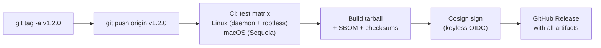

# Releasing

How to cut a release, what happens automatically, and how consumers verify artifacts.

## Overview

Releases follow [Semantic Versioning](https://semver.org/). A release is triggered by pushing a `v*` tag to the repository. The CI pipeline runs the full test matrix, builds a runtime-only tarball, generates an SBOM, signs everything with cosign, and publishes a GitHub Release with all artifacts attached.



## Version numbering

| Change type                                           | Bump  | Example                                  |
| ----------------------------------------------------- | ----- | ---------------------------------------- |
| Breaking `config.nix` layout, removed `nx` subcommand | MAJOR | Drop `--legacy` flag, rename scope files |
| New scope, new `nx` subcommand, new flag              | MINOR | Add `--gcloud` scope, add `nx pin show`  |
| Bug fix, internal refactor, dependency bump, docs     | PATCH | Fix BSD sed regression, bump nixpkgs     |

## Step-by-step: cutting a release

### 1. Update the changelog

Every PR that changes runtime files (`nix/`, `.assets/`, `wsl/`) must have an entry under `## [Unreleased]` in `CHANGELOG.md`. The `check-changelog` pre-commit hook enforces this - commits that touch runtime files without a changelog entry are rejected.

Before tagging, review the `[Unreleased]` section and rename it to the version being released:

```markdown
## [1.2.0] - 2026-04-25

### Added
- `nx pin show` command for viewing current nixpkgs pin

### Fixed
- BSD sed regression in profile block injection on macOS
```

Add a fresh `## [Unreleased]` heading above the new version section.

### 2. Build and verify the tarball locally

```bash
make release
```

This command:

1. Checks that the working tree is clean (no uncommitted changes)
2. Reads the latest released version from `CHANGELOG.md` (the first `## [X.Y.Z] - YYYY-MM-DD` heading, skipping `[Unreleased]`). Override with `make release VERSION=X.Y.Z` if needed.
3. Aborts if `vX.Y.Z` already exists as a git tag - catches the "forgot to add a new release section" mistake.
4. Runs `.assets/tools/build_release.sh` to produce `dist/envy-nx-<version>.tar.gz`
5. Prints the `git tag` and `git push` commands to run

!!! warning "make release does not push"
    The Makefile target deliberately stops after building the tarball and printing the commands. Review the tarball contents before pushing the tag.

Verify the tarball contains only runtime files:

```bash
tar tf dist/envy-nx-*.tar.gz | head -30
```

Expected structure:

```text
envy-nx-1.2.0/
envy-nx-1.2.0/VERSION
envy-nx-1.2.0/nix/
envy-nx-1.2.0/.assets/lib/
envy-nx-1.2.0/.assets/config/
envy-nx-1.2.0/.assets/setup/
envy-nx-1.2.0/.assets/provision/
envy-nx-1.2.0/wsl/
envy-nx-1.2.0/LICENSE
envy-nx-1.2.0/README.md
envy-nx-1.2.0/CHANGELOG.md
...
```

The tarball excludes all development tooling: `tests/`, `scripts/`, `design/`, `docs/`, `Makefile`, `.github/`, `.pre-commit-config.yaml`, Docker files, and `.git/`. It is a self-contained, install-ready archive.

### 3. Tag and push

After reviewing the tarball:

```bash
git tag -a "v1.2.0" -m "Release v1.2.0"
git push origin "v1.2.0"
```

Pushing the tag triggers the `release.yml` workflow.

## What the CI pipeline does

The release workflow runs three jobs sequentially:

### Test matrix

The full test suite runs unconditionally (not gated on PR labels like `test:integration`):

| Job          | Runner      | Nix method    | What it validates                                     |
| ------------ | ----------- | ------------- | ----------------------------------------------------- |
| `test-linux` | ubuntu-slim | Determinate   | Daemon mode: full scope install, `nx doctor --strict` |
| `test-linux` | ubuntu-slim | `--no-daemon` | Rootless/Coder mode: same validation without systemd  |
| `test-macos` | macos-15    | Determinate   | macOS: bash 3.2 + BSD sed, Keychain cert extraction   |

All three must pass before the release job runs.

### Build

1. **Tarball** - `scripts/build_release.sh` produces `envy-nx-<version>.tar.gz` with a stamped `VERSION` file
2. **Checksums** - SHA-256 checksum written to `CHECKSUMS.sha256`
3. **SBOM** - a Nix `buildEnv` is built, its closure is captured via `nix path-info --json --recursive`, and transformed into SPDX 2.3 JSON by `nix_closure_to_spdx.py`
4. **Closure list** - `closure.txt` lists every nix store path in the environment for quick inspection

### Sign

[Cosign](https://docs.sigstore.dev/cosign/overview/) keyless signing via GitHub OIDC. No keys to manage - the signature proves "this artifact was built by this repository's CI pipeline, triggered by this specific tag push."

Each artifact gets a `.bundle` file containing the signature and certificate chain.

### Publish

`gh release create` attaches all artifacts to a GitHub Release. The release body is extracted from `CHANGELOG.md` - either the section matching the tag version or the `[Unreleased]` section as fallback.

## Release artifacts

Every GitHub Release includes:

| Artifact                   | Purpose                                                 |
| -------------------------- | ------------------------------------------------------- |
| `envy-nx-<version>.tar.gz` | Runtime-only tarball (~100KB), ready to extract and run |
| `CHECKSUMS.sha256`         | SHA-256 checksum for integrity verification             |
| `sbom.spdx.json`           | SPDX 2.3 Software Bill of Materials for the nix closure |
| `closure.txt`              | Flat list of nix store paths in the environment         |
| `envy-nx-*.tar.gz.bundle`  | Cosign signature bundle for the tarball                 |
| `sbom.spdx.json.bundle`    | Cosign signature bundle for the SBOM                    |

## Installing from a tarball

The release tarball is an alternative to `git clone` for environments where git is not available, artifact stores are preferred, or a specific version must be pinned.

```bash
# download and extract
curl -sL https://github.com/szymonos/envy-nx/releases/latest/download/envy-nx.tar.gz | tar xz
cd envy-nx

# run setup (same as git clone)
nix/setup.sh --shell --python --pwsh
```

After setup, the extracted directory can be deleted - the environment is self-contained in `~/.config/nix-env/`.

!!! note "Version detection"
    When installed from a tarball, the `VERSION` file provides the version identity instead of `git describe`. The `nx version` command, `install.json` provenance, and `NIX_ENV_VERSION` environment variable all read from this file automatically.

## Verifying artifacts

### Checksum verification

```bash
cd dist/   # or wherever you downloaded the artifacts
shasum -a 256 -c CHECKSUMS.sha256
```

### Cosign signature verification

Requires [cosign](https://docs.sigstore.dev/cosign/system_config/installation/) installed locally:

```bash
cosign verify-blob \
  --bundle envy-nx-1.2.0.tar.gz.bundle \
  --certificate-oidc-issuer https://token.actions.githubusercontent.com \
  --certificate-identity-regexp 'github\.com/szymonos/envy-nx' \
  envy-nx-1.2.0.tar.gz
```

A successful verification confirms:

- The artifact was built by GitHub Actions in the `szymonos/envy-nx` repository
- It has not been modified since signing
- No private keys were involved - the identity proof comes from GitHub's OIDC token

## SBOM

The Software Bill of Materials (`sbom.spdx.json`) lists every package in the nix closure - the complete set of runtime dependencies, including transitive ones. It is generated from `nix path-info --json --recursive` and formatted as [SPDX 2.3](https://spdx.github.io/spdx-spec/v2.3/) JSON.

Each entry includes:

- Package name and version (parsed from the nix store path)
- Download location (`https://cache.nixos.org`)
- Dependency relationships (derived from nix references)

The SBOM enables compliance workflows, vulnerability scanning (feed it to [Grype](https://github.com/anchore/grype) or similar), and audit trails for environments deployed at scale.

## Version skew detection

`nx doctor` includes a `version_skew` check that compares the installed version (from `install.json`) against the latest GitHub Release. When the versions differ, it reports a warning:

```text
  WARN  version_skew: installed 1.1.0, latest release 1.2.0
```

This check requires `gh` CLI and network access. It is a silent no-op when either is unavailable.

## Tarball contents

The release tarball includes only files needed to run `nix/setup.sh` and configure the environment. Everything else is excluded.

**Included:**

| Directory / file       | Purpose                                  |
| ---------------------- | ---------------------------------------- |
| `nix/`                 | Flake, scopes, setup orchestrator        |
| `.assets/lib/`         | Shared libraries (scopes, certs, doctor) |
| `.assets/config/`      | Shell aliases and configuration          |
| `.assets/setup/`       | Post-install user configuration          |
| `.assets/provision/`   | System-scope tool installers             |
| `wsl/`                 | WSL orchestration scripts                |
| `VERSION`              | Stamped version for non-git installs     |
| `LICENSE`, `README.md` | Documentation                            |

**Excluded:**

| Directory / file               | Why excluded                    |
| ------------------------------ | ------------------------------- |
| `tests/`                       | Development only                |
| `scripts/`                     | Build tooling                   |
| `design/`                      | Internal design documents       |
| `docs/`                        | Published separately via MkDocs |
| `.github/`                     | CI workflows                    |
| `Makefile`                     | Developer workflow              |
| `.pre-commit-config.yaml`      | Developer workflow              |
| `.assets/docker/`              | Smoke test infrastructure       |
| `nix/config.nix`, `flake.lock` | Generated at install time       |
