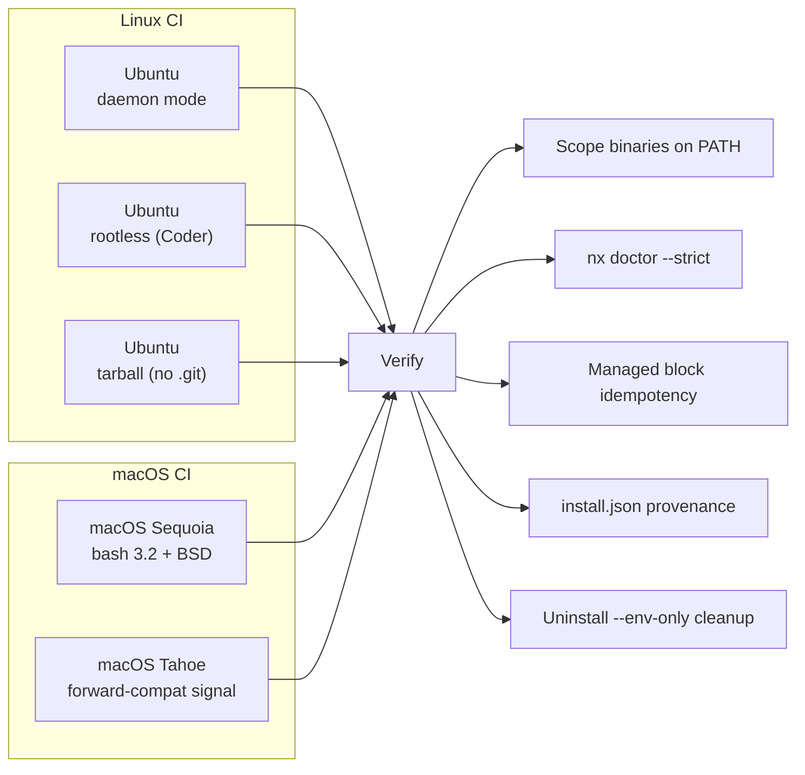
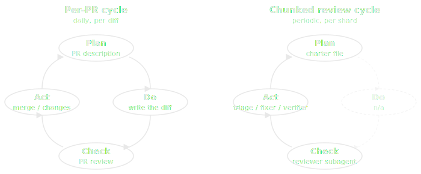

# Quality & Testing

This tool provisions developer environments - if it breaks, developers cannot work. The engineering standards applied to this repository reflect that criticality. This page documents how the codebase enforces its own quality, primarily through automated, CI-validated constraints, backstopped by a periodic human-triggered review framework for what diff-based gates cannot see.

## By the numbers

| Metric                       | Value                                                                       |
| ---------------------------- | --------------------------------------------------------------------------- |
| Unit test files              | 30 (21 bats + 9 Pester)                                                     |
| Individual test cases        | 583 (444 bats + 139 Pester)                                                 |
| Test code                    | 8,300+ lines                                                                |
| Custom pre-commit hooks      | 12 Python scripts                                                           |
| Pre-commit checks per commit | 24 hooks                                                                    |
| CI workflows                 | 7 (preflight, CodeQL, Linux, macOS, upgrade walk, release, docs)            |
| CI matrix axes               | 5 (Linux daemon, Linux rootless, Linux tarball, macOS Sequoia, macOS Tahoe) |
| Platforms validated per PR   | macOS (bash 3.2 + BSD), Ubuntu (bash 5 + GNU)                               |
| Standing review shards       | 9 charter-driven, manual `/review` trigger                                  |

## Why these standards exist

Every check on this page is here for the same reason: **backpressure**. Automated, machine-readable feedback that catches mistakes at the point they're made, not three review rounds later or in production on a developer's laptop.[^1] The rest of this page describes *what* the project defends and *how* it defends it; this section is about *why* the investment is worth it.

Backpressure helps human reviewers - a CI failure on the first push is cheaper than a comment thread on the fifth. But the bar gets higher when AI coding agents (Claude Code, Cursor, Codex, and others) are in the loop. A human re-reads a diff, recognizes a typo from context, fixes it without comment, and moves on. An agent's loop is `propose change -> observe feedback -> revise`, and if the feedback is silent, slow, or noisy the loop diverges. Optimizing the check infrastructure for agents incidentally makes it better for humans too. The five properties this codebase optimizes for:

- **Fast** - iteration must complete in seconds, not minutes. `make lint` runs only the hooks affected by the changed files (smart bats / Pester runners parse `source` directives to map files to tests). The full suite runs in CI; the local feedback loop stays under 10 seconds for most commits.
- **Specific** - "lint failed" is unhelpful. `check_bash32.py` doesn't say "incompatible bash"; it says "line 47 uses `mapfile`, which fails on macOS bash 3.2 -- use `while IFS= read -r line; do arr+=("$line"); done < <(...)` instead". Both humans and agents can act on that.
- **Machine-readable** - structured exit codes, file paths, and line numbers. No interactive prompts, no tty-only output, no swallowed stderr. `check-no-tty-read` even forbids the pattern that would silently hang an agent's headless terminal.
- **Symmetric** - the same hook set runs in pre-commit AND in CI (`repo_checks.yml`). Whatever passes locally is what CI re-runs. No second class of "CI-only failures" surfacing five minutes after the change felt done.
- **Closed-loop** - the project's `CLAUDE.md` and `AGENTS.md` files instruct agents to run `make lint` after every change and fix failures before reporting completion. The loop is explicit, not aspirational.

`nx doctor --strict` is the canonical example of compounding backpressure. A human running setup might shrug off a yellow warning ("oh, that scope binary isn't on PATH, I'll deal with it later"). An agent reading `doctor --strict`'s exit code sees a hard failure, traces it to a missing symlink in `~/.nix-profile/`, and fixes it in the same iteration. Same signal, different consumers - but only the strict-mode signal makes the agent loop converge.

[^1]: Bassim Eledath, ["The Levels of Agentic Engineering"](https://www.bassimeledath.com/blog/levels-of-agentic-engineering), 2025.

## What we defend

The checks downstream exist to enforce four invariants. Reading them first makes the rest of the page easier to navigate - every hook, test, and CI workflow is defending one of these.

**Bash 3.2 compatibility.** Nix-path scripts must run on macOS's stock bash 3.2 (no `mapfile`, no `declare -A`, no `${var,,}`, no `declare -n`, no negative array indices). Enforced by `check_bash32.py` at commit time and re-validated on macOS Sequoia in CI - the scan covers 14 categories of bash 4+ constructs and rejects with line numbers.

**Scope consistency.** A scope is a four-tuple: `scopes.json` definition, `nix/scopes/<name>.nix` package list, dependency declarations, and `# bins:` binary declarations. `validate_scopes.py` rejects any partial addition - the four artifacts must agree before commit, not after a runtime failure on a developer's machine.

**Idempotency.** Running `nix/setup.sh` twice must produce identical results: no duplicate managed blocks, no accumulated profile entries, no leftover state. CI explicitly runs setup twice and diffs the result. Without this, recurring `nx upgrade` would slowly corrupt a working install.

**Install provenance.** Every setup run (success or failure) writes `~/.config/dev-env/install.json` with version, scopes, timestamp, and exit status. CI validates the file shape on every PR. This makes fleet-wide audit possible: which developers have which versions, when they last ran setup, whether it succeeded.

## Pre-commit hooks

Every commit passes through 23 hooks split across two categories: **custom hooks** (Python scripts maintained in this repo, purpose-built for this codebase's invariants) and **vendored hooks** (third-party hooks pulled in via `.pre-commit-config.yaml`, covering general-purpose checks). For exact file scopes, hook IDs, and pinned revisions, read `.pre-commit-config.yaml` directly -- the tables below describe intent.

### Custom hooks

12 Python scripts under `tests/hooks/`, wired in as `repo: local` entries:

| Hook                          | Why it exists                                                                                                                                                                                                                        |
| ----------------------------- | ------------------------------------------------------------------------------------------------------------------------------------------------------------------------------------------------------------------------------------ |
| `gremlins-check`              | Catches invisible Unicode (zero-width spaces, smart quotes pasted from chat) before it lands in shell scripts where it changes execution semantics.                                                                                  |
| `validate-docs-words`         | Keeps the cspell custom dictionary tied to actual docs usage -- removes entries no doc still references, so the dictionary doesn't become a graveyard of words from deleted pages.                                                   |
| `align-tables`                | Auto-aligns markdown table columns so a one-character cell change doesn't produce a multi-hundred-column git diff.                                                                                                                   |
| `validate-scopes`             | A scope is a four-tuple (JSON definition, Nix package list, dependency rules, binary declarations). Catches partial additions where one of the four is updated but the others aren't.                                                |
| `check-bash32`                | Blocks bash 4+ syntax in scripts that have to run on macOS's stock bash 3.2. The diagnostic includes the offending line and the recommended portable rewrite, not just "incompatible".                                               |
| `check-zsh-compat`            | All bash scripts that get sourced into the user's zsh profile must avoid the patterns where bash and zsh disagree (function declarations, glob no-match behavior, completion builtins).                                              |
| `check-no-tty-read`           | Forbids `read` redirected from `/dev/tty` in setup scripts unless explicitly self-attested. The pattern silently hangs in interactive shells but silently passes in headless CI / agents -- the worst kind of bug to ship.           |
| `check-md-html-tags`          | Forbids unbalanced tag-like `<...` substrings in `docs/*.md` -- Python-Markdown's HTML preprocessor consumes them as malformed tag openers (even inside backticks), silently dropping subsequent rendered content. Recurrence guard. |
| `check-changelog`             | Runtime file changes require a CHANGELOG entry under `[Unreleased]`. Can be skipped via a label when the change is genuinely doc-only.                                                                                               |
| `check-nx-generated`          | The `nx` CLI's bash, zsh, and PowerShell completers are generated from a single JSON surface description. Catches mismatches between the source and the generated artifacts -- usually means somebody hand-edited a generated file.  |
| `bats-tests` / `pester-tests` | Smart test runners that map changed files to the tests that source them -- only re-runs tests the change could affect, not the full suite.                                                                                           |

### Vendored hooks

Third-party hooks for general-purpose checks. Each is a problem the project would otherwise have to write itself; trading the dependency for not maintaining yet another linter is the right call.

| Source                          | Hook(s)                                                                                                                        | Why it exists                                                                                                                                                                                      |
| ------------------------------- | ------------------------------------------------------------------------------------------------------------------------------ | -------------------------------------------------------------------------------------------------------------------------------------------------------------------------------------------------- |
| `pre-commit/pre-commit-hooks`   | `check-executables-have-shebangs`, `check-shebang-scripts-are-executable`, `end-of-file`, `line-ending`, `trailing-whitespace` | Filesystem hygiene the editor often lets through: executable bits matching shebangs, consistent line endings across platforms, no whitespace drift.                                                |
| `astral-sh/ruff-pre-commit`     | `ruff-check`, `ruff-format`                                                                                                    | Python lint and formatter for the custom hooks under `tests/hooks/` -- the only Python in the repo, but held to the same standard as a real Python project.                                        |
| `DavidAnson/markdownlint-cli2`  | `markdownlint-cli2`                                                                                                            | Markdown structural rules: heading hierarchy, list spacing, fenced-code language hints, link form. The `align-tables` custom hook handles column padding, which markdownlint deliberately doesn't. |
| `streetsidesoftware/cspell-cli` | `cspell`                                                                                                                       | Spell check on every `.md` file plus on commit messages -- PR titles and changelog entries don't ship typos.                                                                                       |
| `scop/pre-commit-shfmt`         | `shfmt`                                                                                                                        | Shell formatter (2-space indent, OTBS braces). Consistent shape across hundreds of script files, applied automatically.                                                                            |
| `koalaman/shellcheck-precommit` | `shellcheck`                                                                                                                   | Shell static analysis. Catches unquoted expansions, the consequences of missing `set -e`, and the long tail of shell foot-guns that aren't worth manually reviewing.                               |

`mkdocs build --strict` is intentionally not a pre-commit hook - it requires the full docs dependency set, so it lives in CI (`repo_checks.yml`) where the environment is reliable.

## Unit tests

21 bats files cover bash logic: scope dependency resolution, `nx` CLI commands and tab completers, managed-block injection / removal, profile migration, the overlay system, health checks, certificate handling, manager-scope removal hooks (`conda`, `nodejs`, `python`), and zsh runtime smoke tests.

9 Pester files mirror this for PowerShell components: WSL orchestration (high-level integration in `WslSetup.Tests.ps1`), the 16 phase functions extracted from `wsl/wsl_setup.ps1` into the `utils-setup` module (`WslSetupPhases.Tests.ps1` - 49 unit tests across the new module surface), scope parsing, certificate conversion, and the `nx` CLI argument completer.

Phase functions from `nix/lib/phases/` are tested by sourcing them directly and overriding the `_io_nix` / `_io_run` / `_io_curl_probe` side-effect wrappers - three lines per test, no mocking framework, no external dependencies. The same pattern works identically on bash 3.2 and bash 5, so a single test file proves both portability and correctness.

Tests run locally in two ways: the file-aware `bats-tests` and `pester-tests` pre-commit hooks (only relevant tests on commit) and `make test-unit` (the full suite, parallelized across 4 bats workers and one Pester session). Both paths complete in under 30 seconds on a modern laptop.

## CI pipelines

Local checks catch what the developer can iterate on quickly; CI re-runs them in a clean environment and adds checks that need real platforms, more time, or deferred timing.

| Workflow                | Trigger                           | What it adds beyond local hooks                                                                                                                                                                                                                                      |
| ----------------------- | --------------------------------- | -------------------------------------------------------------------------------------------------------------------------------------------------------------------------------------------------------------------------------------------------------------------- |
| `repo_checks.yml`       | every PR (auto)                   | Re-runs the full pre-commit hook set against the PR diff in a clean Ubuntu image (catches "works on my machine" gaps, missing dependencies, hooks the developer skipped). Builds the docs with `mkdocs build --strict` -- broken cross-references fail the PR.       |
| CodeQL                  | every PR + push to main           | Static security analysis on Python (custom hooks under `tests/hooks/`) and on the GitHub Actions workflows themselves. Catches injection patterns, unsafe interpolations, secret leakage, and workflow-side privilege escalation that no shell linter would surface. |
| `test_linux.yml`        | label `test:integration` + manual | Full provisioning matrix on real Ubuntu runners across the two Nix install modes: `daemon` (multi-user, WSL / bare-metal / managed-Mac scenario) and `no-daemon` (rootless / Coder scenario). Plus the tarball-mode job for installs without `.git` history.         |
| `test_macos.yml`        | label `test:integration` + manual | Full provisioning matrix on macOS Sequoia (the bash 3.2 + BSD baseline) and macOS Tahoe (forward-compat signal). The single most expensive backstop for the bash 3.2 portability rule.                                                                               |
| `test_upgrade_walk.yml` | weekly cron + manual              | Cross-version upgrade walk -- see below. Asynchronous because no PR should pay for it, but it bisects upgrade regressions before users hit them.                                                                                                                     |
| `release.yml`           | tag push                          | Builds and publishes the release artifacts on tag. Validates that the tag exists on `main` and that `CHANGELOG.md` has a matching section.                                                                                                                           |
| `docs-gh-pages.yml`     | push to main                      | Publishes the rendered docs site. Doubles as a second `mkdocs build --strict` run on the merged tree.                                                                                                                                                                |

Integration tests are gated by a `test:integration` label rather than running on every PR because they take 10-25 minutes per matrix axis. The label is sticky: once added, every push to that PR re-runs the matrix automatically.

### Integration matrix

The Linux + macOS workflows together exercise five real-OS axes in parallel:



Each axis runs the full setup with a representative scope set, then verifies:

- Setup completes with the requested scope flags
- Core binaries (`git`, `gh`, `jq`, `curl`, `openssl`) resolve on PATH
- Scope-specific binaries resolve (mapped from scope flags)
- `nx doctor --strict` passes (warnings and failures both break the build)
- Second run produces exactly one managed block (idempotency invariant)
- `install.json` records `status: success` (provenance invariant)
- `nix/uninstall.sh --env-only` removes nix-env state while preserving generic config

### Cross-version upgrade walk

`.github/workflows/test_upgrade_walk.yml` walks every released tag newest → oldest in a single sequential job. For each tag it installs at the old version, switches the repo to HEAD, runs `nx setup` (the user-facing upgrade path), and verifies the result: family files synced, `nx version` matches HEAD, `nx doctor --strict` passes. The walk fail-fasts at the first failure, surfacing the **upgrade-supported floor** - the oldest version that still upgrades cleanly to HEAD.

Cheap relative to the platform matrix: ONE Nix install per run, package cache warms across iterations. Only user-scope state (`~/.config/nix-env/`, managed shell blocks, alias files) is wiped between iterations via `nix/uninstall.sh --env-only`; `/nix/store` and the per-user nix profile persist (those are validated by the matrix). Triggered by `workflow_dispatch` (with optional single-tag and floor-version inputs) plus a weekly cron (Mondays 06:00 UTC).

This catches a class of regression the matrix cannot: a refactor on HEAD that breaks the migration path from a real installed version. The matrix runs fresh installs in parallel; nothing exercises "user installed at v1.x.y, then ran `nx setup` against today's HEAD" until the walk does. As an agent-friendly side-effect, an investigator can dispatch the workflow with `from-version=v1.5.4` and read a structured pass/fail summary - bisection without a human in the loop.

### Docker smoke tests

`make test-nix` builds a throwaway Docker image that runs a full nix provisioning pass, verifies the `nx` CLI, validates `install.json`, and tests the `--env-only` uninstaller - all in an isolated container. Slower than unit tests but catches integration issues that mocking cannot. Run on demand by maintainers before merging anything that touches the nix path; not part of the default `make test` because of the Docker pull.

`make test-upgrade-walk` runs the cross-version upgrade walk in the same Docker base image, sharing the script with the CI workflow (`.github/scripts/upgrade_walk.sh`). Use it to reproduce a CI walk failure locally without waiting for the next cron.

## Make: the unified entry point

Every check, test, build, and operation in this repo is reachable through a `make` target. There is no second command surface to learn -- not `prek run --hook-id ...`, not `bats tests/bats/foo.bats`, not `python3 -m tests.hooks.gen_nx_completions`. `make help` enumerates everything, parsed automatically from `##`-prefixed comments next to each target so new tooling shows up without a separate doc update.

```bash
make install                      # install pre-commit hooks (one-time)
make lint                         # run hooks on changed files (before every commit)
make test-unit                    # bats + Pester unit tests (fast, no Docker)
make test                         # all tests including Docker smoke tests
make test-nix                     # Docker smoke test for the nix path
make test-upgrade-walk            # cross-version upgrade walk in Docker
make lint-diff                    # hooks on files changed since main
make hooks                        # list available hook IDs
make lint-all HOOK=<hook_id>      # run a single hook on all files (fast iteration)
make mkdocs-serve                 # live-reload documentation preview
```

### One contract, four consumers

The backpressure properties at the top of this page depend on `make` being a single, consistent target surface across every party that needs to run a check:

| Consumer                                          | Command     |
| ------------------------------------------------- | ----------- |
| Pre-commit hook (every commit)                    | `make lint` |
| CI workflow `repo_checks.yml`                     | `make lint` |
| `CLAUDE.md` / `AGENTS.md` (every AI agent change) | `make lint` |
| Contributor reading the README                    | `make lint` |

Same target, same expectation. Drift is impossible -- if `make lint` is wrong, every consumer is wrong simultaneously, which means it gets fixed instantly. Without this layer every consumer would maintain its own list of invocations and they'd silently disagree the moment a hook moves.

For agents specifically, this is the part that closes the backpressure loop. An agent can grep the `Makefile` for `^[a-z-]+:` lines to discover the full command surface without project-specific training, then dispatch via the consistent `make <target>` form. The Makefile *is* the library -- there's no list of project-specific invocations to memorize, and `make` returns a clean exit code for every target so the output streams straight into a self-correction loop.

### Tab completion

The `shell` scope installs `bash-completion` and configures `compinit` for zsh as part of standard developer setup. Tab-completing `make te<TAB>` in either shell cycles through `test`, `test-nix`, `test-unit`, `test-upgrade-walk` -- both shells parse the local `Makefile` for available targets natively. PowerShell users get a `Register-MakeCompleter` function (vendored from the `do-linux` module) they can add to their profile for the same behavior; not auto-invoked, since pwsh sessions don't always sit in a Make-aware directory.

Discoverability without RTFM matters more for agents than humans. A human can be told once that `make help` exists; an agent in a fresh session needs the surface to be shell-discoverable, and tab completion is exactly that signal.

### MITM proxy support, transparent

The Makefile detects custom CA certificates (`~/.config/certs/ca-custom.crt`, written by the cert-overlay machinery during setup) and exports `PREK_NATIVE_TLS=1` for the pre-commit runner plus `NODE_EXTRA_CA_CERTS` for Node-based hooks (markdownlint, cspell). Developers behind corporate proxies don't need to configure anything; agents don't need to know the proxy exists. One more thing the contract handles so the consumer doesn't have to.

## Beyond automated gates: periodic review

Every check above this section fires on a diff: a commit, a PR, a push. That's the right shape for catching the regression you're about to introduce, but it cannot see what's already standing in the codebase - drift, dead code, workarounds whose upstream bug got fixed years ago, cross-shard inconsistencies that each per-PR review correctly let through in isolation. A diff-blind problem needs a diff-blind tool.



Per-PR fires per diff (full PDCA, all four phases). Chunked fires per shard on a manual cadence (Plan / Check / Act only - no Do, since the code already exists). Per-PR catches what's being added; chunked catches what's already there.

The repo runs a periodic chunked agentic-review framework orthogonally to the daily PR cycle. Nine shards by concern (`certs`, `orchestration`, `nx-cli`, `config-templates`, `system-installers`, `wsl-orchestration`, `precommit-hooks`, `test-quality`, `enterprise-readiness`), each with a versioned charter that defines scope, "what good looks like", and what NOT to flag. One shard is reviewed at a time on a manual cadence (`/review <shard>`), rotating through the nine so the whole repo cycles every two months without overloading any single review's context.

Three subagents with deliberately separated roles and restricted tool sets:

- **Reviewer** - `Read, Grep, Glob, Bash` only. Cannot edit code; the tool restriction is the bias-control mechanism (cannot pick easy issues because cannot fix anything). Outputs structured findings JSON.
- **Triage** - interactive, human in the loop. Each finding gets `apply | defer | dispute`; defers and disputes accumulate in a versioned ledger so the next review skips them.
- **Fixer** - minimum-scope edits, one commit per finding, gates each commit on `make lint && make test-unit`. Hard DONE marker is machine-verifiable, not LLM judgment.
- **Verifier** - read-only second opinion on the fixer's diff. Reads cold; asks whether each fix addresses the root cause or just silences the symptom. Escalates via report; cannot edit, cannot approve a PR.

This is **manual machinery, not automated**. There is no cron, no CI gate, no auto-merge. The framework's value is not "more enforcement" - it's a periodic outside view on the standing state, with bias controls baked into the agent definitions rather than left to convention. Findings drive triage; human judgment decides which to fix.

Just landed as v1; charters were seeded from the existing codebase before any actual review run, so expect the first cycle on each shard to surface things the charter didn't anticipate. Design rationale: [Process decisions](decisions.md#process-decisions).
